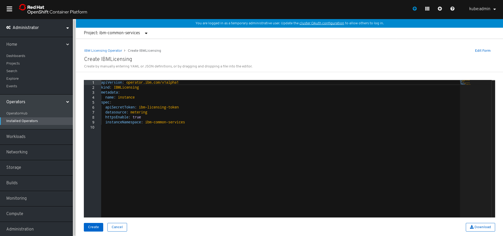

<!-- START doctoc generated TOC please keep comment here to allow auto update -->
<!-- DON'T EDIT THIS SECTION, INSTEAD RE-RUN doctoc TO UPDATE -->
**Table of Contents**  *generated with [DocToc](https://github.com/thlorenz/doctoc)*

- [IBM Licensing Operator](#ibm-licensing-operator)
    - [Overview](#overview)
    - [Installation](#installation)
        - [Install the IBM Licensing Operator On OCP 4.2+](#install-the-ibm-licensing-operator-on-ocp-42)
            - [1. Create OperatorSource](#1-create-operatorsource)
            - [2. Create a Namespace `ibm-common-services`](#2-create-a-namespace-ibm-common-services)
            - [3. Install `IBM Licensing Operator` Package in the OperatorHub](#3-install-ibm-licensing-operator-package-in-the-operatorhub)
        - [Install the IBM Licensing Operator on Kubernetes from scratch](#install-the-ibm-licensing-operator-on-kubernetes-from-scratch)
            - [1. Install Operator Lifecycle Manager](#1-install-operator-lifecycle-manager)
            - [2. Install the Operator Marketplace](#2-install-the-operator-marketplace)
            - [3. Create the OperatorSource](#3-create-the-operatorsource)
            - [4. View Available Operators](#4-view-available-operators)
            - [5. Create an OperatorGroup](#5-create-an-operatorgroup)
            - [6. Create a Subscription](#6-create-a-subscription)
            - [7. Verify Operator health](#7-verify-operator-health)
    - [Using IBM Licensing Service](#using-ibm-licensing-service)
        - [Creating the Instance on OCP 4.2+](#creating-the-instance-on-ocp-42)
    - [Uninstall](#uninstall)
        - [Uninstall from any kubernetes cluster](#uninstall-from-any-kubernetes-cluster)
            - [1. Delete IBMLicensing custom resource](#1-delete-ibmlicensing-custom-resource)
            - [2. Delete subscription](#2-delete-subscription)
            - [3. Delete CSV](#3-delete-csv)
            - [4. Delete CRD](#4-delete-crd)
            - [5. Delete OperatorGroup](#5-delete-operatorgroup)
            - [6. Delete OperatorSource](#6-delete-operatorsource)
            - [7. Delete OperatorMarketplace](#7-delete-operatormarketplace)
            - [8. Uninstall OLM](#8-uninstall-olm)
    - [Troubleshoot](#troubleshoot)
        - [CreateContainerConfigError Marketplace Operator error](#createcontainerconfigerror-marketplace-operator-error)

<!-- END doctoc generated TOC please keep comment here to allow auto update -->

# IBM Licensing Operator

In this document, we will show you how to deploy and use <b>IBM Licensing Service</b> inside your Cluster
using Operator Lifecycle Manager.

## Overview

- <b>IBM Licensing Service</b> is a tool that collects licensing data from IBM Products across all cluster.
 It provides API to see the usage and generate Audit Snapshots.
- You can read more about Operators and Operator Lifecycle Manager [here](https://github.com/operator-framework/operator-lifecycle-manager)

## Installation

IBM Licensing Operator can be installed either on vanilla kubernetes, or on [OpenShift Container Platform](https://www.openshift.com/).
It is also a part of bigger project called IBM Cloud Platform Common Services, and could be installed with other Services using [operand-deployment-lifecycle-manager](https://github.com/IBM/operand-deployment-lifecycle-manager)

- If You have OpenShift Container Platform with Version 4.2+ install with [this](#install-the-ibm-licensing-operator-on-ocp-42)
- Otherwise on you can install it with [this](#install-the-ibm-licensing-operator-on-kubernetes-from-scratch)

### Install the IBM Licensing Operator On OCP 4.2+

#### 1. Create OperatorSource

Before install IBM Licensing Operator, this operator source should be created to get operator bundles from `quay.io`.

```yaml
apiVersion: operators.coreos.com/v1
kind: OperatorSource
metadata:
  name: opencloud-operators
  namespace: openshift-marketplace
spec:
  authorizationToken: {}
  displayName: IBMCS Operators
  endpoint: https://quay.io/cnr
  publisher: IBM
  registryNamespace: opencloudio
  type: appregistry
```

Click the plus button, and then copy the above operator source into the editor.


#### 2. Create a Namespace `ibm-common-services`

Open the `OperatorHub` page in OCP console left menu, then `Create Project` named `ibm-common-services`.


#### 3. Install `IBM Licensing Operator` Package in the OperatorHub

Open `OperatorHub` and search `IBM Licensing Operator` to find the operator,
and install it by clicking install.


Select specific namespace `ibm-common-services` that was created in step [Create Project](#2-create-a-namespace-ibm-common-services) and click subscribe.


Now after waiting about 1 minute and clicking installed operators you should see IBM Licensing Operator and it should have status `InstallSucceeded`


### Install the IBM Licensing Operator on Kubernetes from scratch

#### 1. Install Operator Lifecycle Manager

Make sure You are connected to your cluster f.e. using:

```bash
kubectl get node
# check if this shows your nodes
```

Download OLM Release from [here](https://github.com/operator-framework/operator-lifecycle-manager/releases)
For versions newer than 13.0 process might differ, here is script to install OLM v13.0:

```bash
curl -sL https://github.com/operator-framework/operator-lifecycle-manager/releases/download/0.13.0/install.sh | bash -s 0.13.0
```

In case you have any error you might have old kubernetes version. You can try either upgrading your kubernetes server version or using older version of OLM.

#### 2. Install the Operator Marketplace

Clone the following github repo:

```bash
git clone --single-branch --branch release-4.6 https://github.com/operator-framework/operator-marketplace.git
```

Then we need to change `marketplace` namespace to `olm` in order to be able to create subscriptions to our operatorsource/catalogsource from different namespace.
In case your cluster's `global catalog namespace` is different than `olm`, change it below. You can check it at OLM `packageserver*` pod yaml somewhere in your cluster, using `grep global-namespace`.

For linux users:

```bash
export GLOBAL_CATALOG_NAMESPACE=olm
# change all resources namespace to olm
sed -i 's/namespace: .*/namespace: '"${GLOBAL_CATALOG_NAMESPACE}"'/g' operator-marketplace/deploy/upstream/*
# change namespace to olm
sed -i 's/name: .*/name: '"${GLOBAL_CATALOG_NAMESPACE}"'/g' operator-marketplace/deploy/upstream/01_namespace.yaml
```

For MAC users:

```bash
export GLOBAL_CATALOG_NAMESPACE=olm
sed -i "" 's/namespace: .*/namespace: '"${GLOBAL_CATALOG_NAMESPACE}"'/g' operator-marketplace/deploy/upstream/*
sed -i "" 's/name: .*/name: '"${GLOBAL_CATALOG_NAMESPACE}"'/g' operator-marketplace/deploy/upstream/01_namespace.yaml
```

Install Operator Marketplace into the cluster in the `$GLOBAL_CATALOG_NAMESPACE` namespace:

```bash
kubectl apply -f operator-marketplace/deploy/upstream
```

If you get `unknown field "preserveUnknownFields"` error, try to delete preserveUnknownFields from yaml files inside `operator-marketplace/deploy/upstream/` catalog or consider upgrading kubernetes server version:

For linux users:

```bash
sed -i '/.*preserveUnknownFields.*/d' operator-marketplace/deploy/upstream/*
kubectl apply -f operator-marketplace/deploy/upstream
```

For MAC users:

```bash
sed -i "" '/.*preserveUnknownFields.*/d' operator-marketplace/deploy/upstream/*
kubectl apply -f operator-marketplace/deploy/upstream
```

#### 3. Create the OperatorSource

An `OperatorSource` object is used to define the external datastore we are using to store operator bundles. More information including example can be found in the documentation included in the `operator-marketplace` [repository](https://github.com/operator-framework/operator-marketplace#operatorsource).

Before install IBM Licensing Operator, this operator source should be created to get operator bundles from `quay.io`.

```yaml
cat <<EOF | kubectl apply -f -
apiVersion: operators.coreos.com/v1
kind: OperatorSource
metadata:
  name: opencloud-operators
  namespace: $GLOBAL_CATALOG_NAMESPACE
spec:
  authorizationToken: {}
  displayName: IBMCS Operators
  endpoint: https://quay.io/cnr
  publisher: IBM
  registryNamespace: opencloudio
  type: appregistry
EOF
```

The `operator-marketplace` controller should successfully process this object (status should have value Succeeded):

```console
$ kubectl get operatorsource opencloud-operators -n $GLOBAL_CATALOG_NAMESPACE
NAME                  TYPE          ENDPOINT              REGISTRY      DISPLAYNAME       PUBLISHER   STATUS      MESSAGE                                       AGE
opencloud-operators   appregistry   https://quay.io/cnr   opencloudio   IBMCS Operators   IBM         Succeeded   The object has been successfully reconciled   1m32s
```

Additionally, a `CatalogSource` is created in the `$GLOBAL_CATALOG_NAMESPACE` namespace:

```console
$ kubectl get catalogsource -n $GLOBAL_CATALOG_NAMESPACE
NAME                           DISPLAY                        TYPE   PUBLISHER   AGE
opencloud-operators            IBMCS Operators                grpc   IBM         20m
[...]
```

If everything goes well You should see these pods:

```console
$ kubectl get pod -n $GLOBAL_CATALOG_NAMESPACE
NAME                                            READY   STATUS    RESTARTS   AGE
marketplace-operator-6576b4ddc8-dqcgr           1/1     Running   0          84s
opencloud-operators-66df4d97ff-4rhjj            1/1     Running   0          80s
upstream-community-operators-7ffb6b674b-7qlvx   1/1     Running   0          80s
[...]
```

If something seems wrong check [troubleshoot](#createcontainerconfigerror-marketplace-operator-error)

#### 4. View Available Operators

Once the `OperatorSource` and `CatalogSource` are deployed, the following command can be used to list the available operators, this should include ibm-licensing-operator-app
> The command below assumes `opencloud-operators` as the name of the `OperatorSource` object. Adjust accordingly.

```console
$ kubectl get opsrc opencloud-operators -o=custom-columns=NAME:.metadata.name,PACKAGES:.status.packages -n $GLOBAL_CATALOG_NAMESPACE
NAME                  PACKAGES
opencloud-operators   ibm-meta-operator-bridge-app,ibm-commonui-operator-app,ibm-catalog-ui-operator-app,ibm-metering-operator-app,ibm-helm-repo-operator-app,ibm-iam-operator-app,ibm-elastic-stack-operator-app,ibm-monitoring-exporters-operator-app,ibm-monitoring-prometheusext-operator-app,cp4foobar-operator-app,ibm-healthcheck-operator-app,ibm-platform-api-operator-app,ibm-management-ingress-operator-app,ibm-helm-api-operator-app,ibm-licensing-operator-app,ibm-ingress-nginx-operator-app,ibm-monitoring-grafana-operator-app,ibm-auditlogging-operator-app,operand-deployment-lifecycle-manager-app,ibm-mgmt-repo-operator-app,ibm-mongodb-operator-app,ibm-cert-manager-operator-app
```

#### 5. Create an OperatorGroup

An `OperatorGroup` is used to denote which namespaces your Operator should be watching.
It must exist in the namespace where your operator should be deployed, we'll use `ibm-common-services`.
First create namespace for IBM Licensing Operator:

```bash
kubectl create namespace ibm-common-services
```

Deploy the `OperatorGroup` resource:

```yaml
cat <<EOF | kubectl apply -f -
apiVersion: operators.coreos.com/v1alpha2
kind: OperatorGroup
metadata:
  name: operatorgroup
  namespace: ibm-common-services
spec:
  targetNamespaces:
  - ibm-common-services
EOF
```

#### 6. Create a Subscription

The last piece ties together all of the previous steps. A `Subscription` is created to the operator.
Create the `Subscription` using:

```yaml
cat <<EOF | kubectl apply -f -
apiVersion: operators.coreos.com/v1alpha1
kind: Subscription
metadata:
  name: ibm-licensing-operator-app
  namespace: ibm-common-services
spec:
  channel: alpha
  name: ibm-licensing-operator-app
  source: opencloud-operators
  sourceNamespace: $GLOBAL_CATALOG_NAMESPACE
EOF
```

#### 7. Verify Operator health

Watch IBM Licensing Operator being deployed by OLM from the catalog source created by Operator Marketplace with the following command:

```console
$ kubectl get clusterserviceversion -n ibm-common-services
NAME                            DISPLAY                  VERSION   REPLACES                        PHASE
ibm-licensing-operator.v1.0.0   IBM Licensing Operator   1.0.0     ibm-licensing-operator.v0.0.0   Succeeded
```

> The above command assumes you have created the `Subscription` in the `ibm-common-services` namespace.
If your Operator deployment (CSV) shows a `Succeeded` in the `InstallPhase` status, your Operator is deployed successfully. If that's not the case check the `ClusterServiceVersion` objects status for details.
Optional also check your Operator's deployment:

```bash
kubectl get deployment -n ibm-common-services | grep ibm-licensing-operator
```

## Using IBM Licensing Service

After you successfully installed IBM Licensing Operator you can create IBMLicensing instance that will make IBM Licensing Service running in cluster.

### Creating the Instance on OCP 4.2+

If you have OCP 4.2+ you can create the instance from the OCP UI->Installed Operators->IBM Licensing Operator->IBM Licensing tab->Create IBMLicensing

This should look like this:


Then after clicking create you can edit your parameters:


Make sure to use `metering` datasource if IBM Metering Service exits in your cluster.
Otherwise you <b>need</b> to change datasource to `datacollector`:


Other parameters are described here: [IBMLicensingOperatorParameters](images/IBMLicensingOperatorParameters.ods)

## Uninstall

### Uninstall from any kubernetes cluster

These steps assume you have deployed IBM Licensing Service in ibm-common-services namespace

#### 1. Delete IBMLicensing custom resource

Delete instance after which operator should clean its resources.
Check what ibmlicensing instances you have:

```bash
licensingNamespace=ibm-common-services
kubectl get ibmlicensing -n ${licensingNamespace} -o jsonpath="{range .items[*]}{.metadata.name}{'\n'}"
```

Above command should return one instance. Delete it if exists:

```bash
licensingNamespace=ibm-common-services
instanceName=`kubectl get ibmlicensing -n ${licensingNamespace} -o jsonpath="{range .items[*]}{.metadata.name}{'\n'}"`
kubectl delete ibmlicensing ${instanceName} -n ${licensingNamespace}
```

#### 2. Delete subscription

Show subscriptions with:

```bash
licensingNamespace=ibm-common-services
kubectl get subscription -n ${licensingNamespace} -o jsonpath="{range .items[*]}{.metadata.name}{'\n'}"
```

Delete ibm-licensing-operator-app subscription:

```bash
licensingNamespace=ibm-common-services
subName=ibm-licensing-operator-app
kubectl delete subscription ${subName} -n ${licensingNamespace}
```

#### 3. Delete CSV

Delete CSV that manages Operator image.
Get your CSV name, look for ibm-licensing-operator:

```bash
licensingNamespace=ibm-common-services
kubectl get clusterserviceversion -n ${licensingNamespace} -o jsonpath="{range .items[*]}{.metadata.name}{'\n'}"
kubectl get clusterserviceversion -n ${licensingNamespace} -o jsonpath="{range .items[*]}{.metadata.name}{'\n'}" | grep ibm-licensing-operator
```

Delete it:

```bash
licensingNamespace=ibm-common-services
csvName=`kubectl get clusterserviceversion -n ${licensingNamespace} -o jsonpath="{range .items[*]}{.metadata.name}{'\n'}" | grep ibm-licensing-operator`
kubectl delete clusterserviceversion ${csvName} -n ${licensingNamespace}
```

#### 4. Delete CRD

Delete custom resource definition

```bash
kubectl delete CustomResourceDefinition ibmlicensings.operator.ibm.com
```

#### 5. Delete OperatorGroup

If you also have other subscriptions tied with that operatorGroup do not delete it.
IBM Licensing Operator should be uninstalled now but you can also cleanup operatorgroup you created for subscription:

```bash
licensingNamespace=ibm-common-services
operatoGroupName=operatorgroup
kubectl delete OperatorGroup ${operatorGroupName} -n ${licensingNamespace}
```

#### 6. Delete OperatorSource

If you have other services using opencloudio catalog source do not delete the OperatorSource.
Otherwise if you want to delete it use:

```bash
export GLOBAL_CATALOG_NAMESPACE=olm
opencloudioSourceName=opencloud-operators
kubectl delete OperatorSource ${opencloudioSourceName} -n ${GLOBAL_CATALOG_NAMESPACE}
```

#### 7. Delete OperatorMarketplace

WARNING!!! Make sure you are not using it elsewhere.

```bash
export GLOBAL_CATALOG_NAMESPACE=olm
kubectl delete -f operator-marketplace/deploy/upstream
```

#### 8. Uninstall OLM

WARNING!!! Make sure you are not using it elsewhere.

```bash
export GLOBAL_CATALOG_NAMESPACE=olm
kubectl delete crd clusterserviceversions.operators.coreos.com \
installplans.operators.coreos.com \
subscriptions.operators.coreos.com \
catalogsources.operators.coreos.com \
operatorgroups.operators.coreos.com
kubectl delete namespace ${GLOBAL_CATALOG_NAMESPACE}
```

## Troubleshoot

### CreateContainerConfigError Marketplace Operator error

If something goes wrong while installing operator-marketplace look for pods in marketplace.
If you see error like this:

```console
$ kubectl get pod -n $GLOBAL_CATALOG_NAMESPACE
NAME                                    READY   STATUS                       RESTARTS   AGE
marketplace-operator-7d4c5bdb5-mxsj6    0/1     CreateContainerConfigError   0          1m36s
```

You can check what the problem is using yaml (using your pod name)

```bash
kubectl get pod marketplace-operator-7d4c5bdb5-mxsj6 -n $GLOBAL_CATALOG_NAMESPACE -o yaml
```

If it will show error like `container has runAsNonRoot and image has non-numeric user (marketplace-operator), cannot verify user is non-root`
in status, You can fix it by adding securityContext to operator-marketplace/deploy/upstream:

```console
vim operator-marketplace/deploy/upstream/08_operator.yaml
```

Then append lines mentioned here:

```yaml
...
      containers:
        - name: marketplace-operator
          securityContext: # <- this
            runAsUser: 65534 # <- and this
          image: quay.io/openshift/origin-operator-marketplace:latest
...
```

And then apply the configuration:

```bash
kubectl apply -f operator-marketplace/deploy/upstream/08_operator.yaml
```
