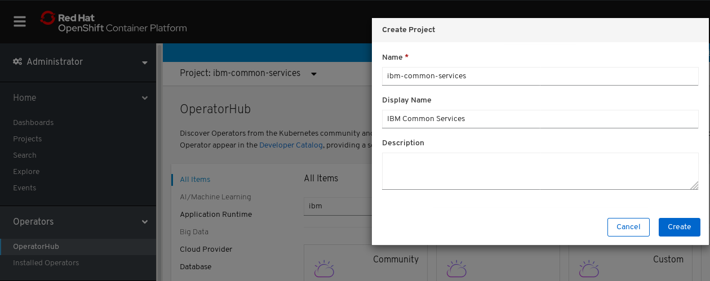
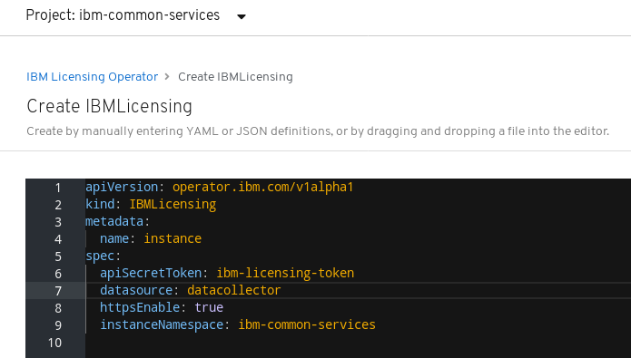
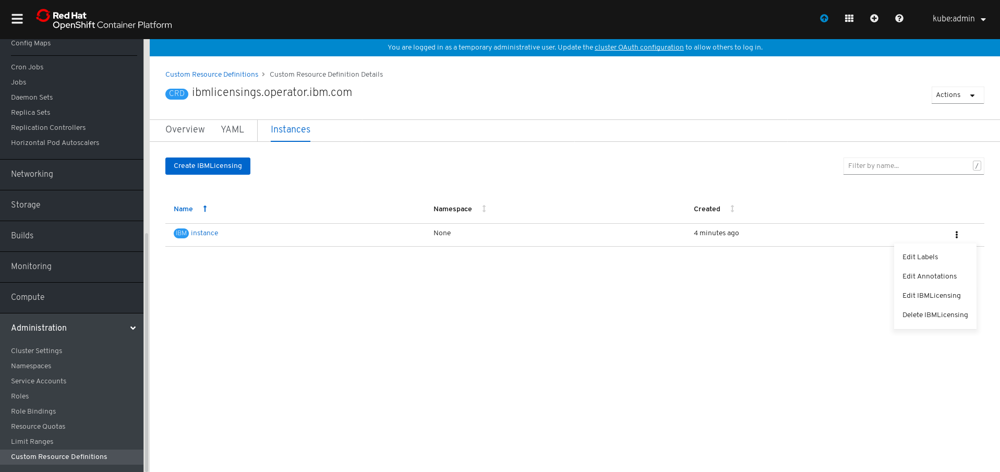

[](https://goreportcard.com/report/github.com/IBM/ibm-licensing-operator)

You can install License Service with ibm-licensing-operator to collect license usage information in two scenarios:
* [License Service as a part of an IBM Cloud Pak (included in IBM Cloud Platform Common Services)](#ibm-licensing-operator)
* [License Service for stand-alone IBM Containerized Software without IBM Cloud Paks](#ibm-licensing-operator-for-stand-alone-ibm-containerized-software)

# ibm-licensing-operator

<b>Scenario: License Service as a part of an IBM Cloud Pak (included in IBM Cloud Platform Common Services)</b>

> **Important:** Do not install this operator directly. Only install this operator using the IBM Common Services Operator. For more information about installing this operator and other Common Services operators, see [Installer documentation](http://ibm.biz/cpcs_opinstall). If you are using this operator as part of an IBM Cloud Pak, see the documentation for that IBM Cloud Pak to learn more about how to install and use the operator service. For more information about IBM Cloud Paks, see [IBM Cloud Paks that use Common Services](http://ibm.biz/cpcs_cloudpaks).

You can use the ibm-licensing-operator to install License Service as a part of IBM Cloud Platform Common Services or an IBM Cloud Pak. You can use License Service to collect information about license usage of IBM containerized products and IBM Cloud Paks per cluster. You can retrieve license usage data through a dedicated API call and generate an audit snapshot on demand.

For more information about the available IBM Cloud Platform Common Services, see the [IBM Knowledge Center](http://ibm.biz/cpcsdocs).

## Supported platforms

Red Hat OpenShift Container Platform 4.2 or newer installed on one of the following platforms:
   - Linux x86_64

## Operator versions

- 1.0.0
- 1.1.0
- 1.1.1
- 1.1.2
- 1.1.3

## Prerequisites

Before you install this operator, you need to first install the operator dependencies and prerequisites:

- For the list of operator dependencies, see the IBM Knowledge Center [Common Services dependencies documentation](http://ibm.biz/cpcs_opdependencies).
- For the list of prerequisites for installing the operator, see the IBM Knowledge Center [Preparing to install services documentation](http://ibm.biz/cpcs_opinstprereq).

> **Important:** If you installed License Service with the stand-alone IBM containerized software and you want to install an IBM Cloud Pak, it is recommended to first uninstall License Service from every cluster. Before uninstalling, the best practice is to retrieve an audit snapshot to ensure no data is lost. The Cloud Pak will install a new instance of License Service. This is a temporary action that we would like to automate in the future.

## Documentation

To install the operator with the IBM Common Services Operator follow the the installation and configuration instructions within the IBM Knowledge Center.

- If you are using the operator as part of an IBM Cloud Pak, see the documentation for that IBM Cloud Pak. For a list of IBM Cloud Paks, see [IBM Cloud Paks that use Common Services](http://ibm.biz/cpcs_cloudpaks).
- If you are using the operator with an IBM Containerized Software, see the IBM Cloud Platform Common Services Knowledge Center [Installer documentation](http://ibm.biz/cpcs_opinstall).

## SecurityContextConstraints Requirements

License Service supports running with the OpenShift Container Platform 4.3 default restricted Security Context Constraints (SCCs).

For more information about the OpenShift Container Platform Security Context Constraints, see [Managing Security Context Constraints](https://docs.openshift.com/container-platform/4.3/authentication/managing-security-context-constraints.html).

# ibm-licensing-operator for stand-alone IBM Containerized Software

<b>Scenario: License Service for stand-alone IBM Containerized Software without IBM Cloud Paks</b>

You can use the ibm-licensing-operator to install License Service on Kubernetes clusters for stand-alone IBM Containerized Software. You can use License Service to collect information about license usage of IBM containerized products. You can retrieve license usage data through a dedicated API call and generate an audit snapshot on demand.

Use this scenario, only when you do not have IBM Cloud Platform Common Services or IBM Cloud Paks installed.

## Supported platforms for ibm-licensing-operator with stand-alone IBM Containerized Software

License Service is supported on all Kubernetes-orchestrated clouds on Linux x86_64. It was tested on the following systems:
- Red Hat OpenShift Container Platform 3.11, 4.1, 4.2, 4.3 or newer
- Kubernetes 1.11.3 or higher
- IBM Cloud Kubernetes Services (IKS)
- Google Kubernetes Engine (GKE)
- Azure Kubernetes Service (AKS)
- Amazon EKS - Managed Kubernetes Service (EKS)

## Operator versions for ibm-licensing-operator with stand-alone IBM Containerized Software

- 1.0.0
- 1.1.0
- 1.1.1
- 1.1.2
- 1.1.3

## Documentation for ibm-licensing-operator with stand-alone IBM Containerized Software

<!-- START doctoc generated TOC please keep comment here to allow auto update -->
<!-- DON'T EDIT THIS SECTION, INSTEAD RE-RUN doctoc TO UPDATE -->
**Table of Contents**  *generated with [DocToc](https://github.com/thlorenz/doctoc)*

- [Cleaning no longer needed dependencies](#cleaning-no-longer-needed-dependencies)
    - [Cleaning no longer needed dependencies of License Service](#cleaning-no-longer-needed-dependencies-of-license-service)
    - [Cleaning no longer needed dependencies of License Service on OpenShift Container Platform](#cleaning-no-longer-needed-dependencies-of-license-service-on-openshift-container-platform)
- [Installing License Service](#installing-license-service)
    - [Automatically installing ibm-licensing-operator with a stand-alone IBM Containerized Software using Operator Lifecycle Manager (OLM)](#automatically-installing-ibm-licensing-operator-with-a-stand-alone-ibm-containerized-software-using-operator-lifecycle-manager-olm)
    - [Manually installing License Service on OCP 4.2+](#manually-installing-license-service-on-ocp-42)
    - [Manually installing License Service on Kubernetes from scratch with `kubectl`](#manually-installing-license-service-on-kubernetes-from-scratch-with-kubectl)
    - [Offline installation](#offline-installation)
- [Post-installation steps](#post-installation-steps)
    - [Create an instance on OpenShift Console 4.2+](#create-an-instance-on-openshift-console-42)
    - [Creating an instance from console](#creating-an-instance-from-console)
- [Using License Service to retrieve license usage information](#using-license-service-to-retrieve-license-usage-information)
- [Using custom certificates](#using-custom-certificates)
- [Uninstalling License Service from a Kubernetes cluster](#uninstalling-license-service-from-a-kubernetes-cluster)
- [Troubleshooting](#troubleshooting)
    - [Prepare resources for offline installation without git](#prepare-resources-for-offline-installation-without-git)


<!-- END doctoc generated TOC please keep comment here to allow auto update -->

### Cleaning no longer needed dependencies

If you installed License Service in the past you can delete no longer needed dependencies, check [Cleaning no longer needed dependencies of License Service](#cleaning-no-longer-needed-dependencies-of-license-service), or [Cleaning no longer needed dependencies of License Service on OpenShift Container Platform](#cleaning-no-longer-needed-dependencies-of-license-service-on-openshift-container-platform)


#### Cleaning no longer needed dependencies of License Service

In earlier versions (up to 1.1.3) License Service was using OperatorSource and OperatorMarketplace which are no longer needed. If you installed License Service in the past, then follow these steps to delete the remains:

1\. **Delete OperatorSource**

```bash
# Make sure GLOBAL_CATALOG_NAMESPACE has global catalog namespace value.
GLOBAL_CATALOG_NAMESPACE=olm
opencloudioSourceName=opencloud-operators
kubectl delete OperatorSource ${opencloudioSourceName} -n ${GLOBAL_CATALOG_NAMESPACE}
```

2\. **Delete OperatorMarketplace**

**Note:** Do not delete the OperatorMarketplace if it is used elsewhere, so e.g. you use other Operators from OperatorMarketplace or when you have OCP cluster.

You can delete the OperatorMarketplace with the following command:

```bash
# Make sure GLOBAL_CATALOG_NAMESPACE has global catalog namespace value.
GLOBAL_CATALOG_NAMESPACE=olm
kubectl delete Deployment marketplace-operator -n ${GLOBAL_CATALOG_NAMESPACE}
kubectl delete RoleBinding marketplace-operator -n ${GLOBAL_CATALOG_NAMESPACE}
kubectl delete ClusterRoleBinding marketplace-operator
kubectl delete ServiceAccount marketplace-operator -n ${GLOBAL_CATALOG_NAMESPACE}
kubectl delete Role marketplace-operator -n ${GLOBAL_CATALOG_NAMESPACE}
kubectl delete ClusterRole marketplace-operator
```

3\. **Follow normal installation steps, as now Catalog Source needs to be installed instead: [Installing License Service](#installing-license-service)**

#### Cleaning no longer needed dependencies of License Service on OpenShift Container Platform

In earlier versions (up to 1.1.3) License Service was using OperatorSource which is no longer needed. If you installed License Service in the past, then follow these steps to delete the remains:

1\. **Delete OperatorSource**

```bash
# Make sure GLOBAL_CATALOG_NAMESPACE has global catalog namespace value.
GLOBAL_CATALOG_NAMESPACE=olm # for OCP this would be "openshift-marketplace"
opencloudioSourceName=opencloud-operators
kubectl delete OperatorSource ${opencloudioSourceName} -n ${GLOBAL_CATALOG_NAMESPACE}
```

2\. **Follow normal installation steps, as now Catalog Source needs to be installed instead: [Installing License Service](#installing-license-service)**


### Installing License Service

Choose the installation path that fits your environment best. You can choose an automatic or a manual procedure. You can also choose to perform offline installation.

- [Automatically installing ibm-licensing-operator with a stand-alone IBM Containerized Software using Operator Lifecycle Manager (OLM)](#automatically-installing-ibm-licensing-operator-with-a-stand-alone-ibm-containerized-software-using-operator-lifecycle-manager-olm)
- [Manually installing License Service on OCP 4.2+](#manually-installing-license-service-on-ocp-42)
- [Manually installing License Service on Kubernetes from scratch with `kubectl`](#manually-installing-license-service-on-kubernetes-from-scratch-with-kubectl)
- [Offline installation](#offline-installation)

<!-- Section below is mentioned by READINESS WIKI that is used by other IBM teams, so after changing this section name, readiness wiki also needs to be changed -->

#### Automatically installing ibm-licensing-operator with a stand-alone IBM Containerized Software using Operator Lifecycle Manager (OLM)

Use the automatic script to install License Service on any Kubernetes-orchestrated cloud. It supports cluster running on x86 architecture. The script creates an instance and validates the steps. It was tested to work on `OpenShift Container Platform 4.2+`, `ICP cluster: v1.12.4+icp-ee`, `vanilla Kubernetes custer`, and is available in this repository at:
[common/scripts/ibm_licensing_operator_install.sh](common/scripts/ibm_licensing_operator_install.sh).

#### Manually installing License Service on OCP 4.2+

<b>Prerequisites</b>
- OCP cluster with 4.2+ version
- Administrator permissions for the OCP cluster
- Access to OpenShift Console

1\. **Create the CatalogSource**

Create the CatalogSource to get the operator bundles that are available at the public website: `quay.io`. The CatalogSource allows your cluster to establish connection to `quay.io`.

a. Log in to the OpenShift console.

b. Click the plus button on the right of the header.

c. Copy the following CatalogSource into the editor.

```yaml
apiVersion: operators.coreos.com/v1alpha1
kind: CatalogSource
metadata:
  name: opencloud-operators
  namespace: openshift-marketplace
spec:
  displayName: IBMCS Operators
  publisher: IBM
  sourceType: grpc
  image: docker.io/ibmcom/ibm-common-service-catalog:latest
  updateStrategy:
   registryPoll:
     interval: 45m
```

d. Click **Create**.

2\. **Create the `ibm-common-services` namespace**

a. From the hamburger menu in the OpenShift console, go to **Operators>Operator Hub**.

b. Expand the list of Projects.

c. Select **Create Project**.


d. Enter **ibm-common-services** as a name and click **Create**.



3\. **Install IBM Licensing Operator package in OperatorHub**

a. Go to **OperatorHub** and search for **IBM Licensing Operator**.

   **Note:** It might take a few minutes for the operator to show up. If, after a while, the operator will not show up, there might be an issue with the CatalogSource.

b. Select **IBM Licensing Operator** and click **Install**.


4\. **Create the operator subscription**

a. Go to **OperatorHub>Operator Subscription**

b. As an Installation Mode select **A specific namespace on the cluster**, and set it to **ibm-common-services** namespace that you created in the previous step.

c. Choose the **stable-v1** channel.

d. Click **Subscribe**.


5\. **Verify that the installation is successful**

To check whether the installation is successful, wait for about 1 minute, and go to **Installed operators**. You should see IBM Licensing Operator with the **Succeeded** status.


**Results:**
You have created the **Operator** for **IBM Licensing Service**. The **Operator** is only responsible for watching over the configuration and managing resources used by **IBM Licensing Service**.
The next step is to configure the **Custom Resource** named **IBM Licensing**. For the instructions, see the [Post-installation steps](#post-installation-steps).

#### Manually installing License Service on Kubernetes from scratch with `kubectl`

**Prerequisites**
- Administrator permissions for the cluster
- `kubectl` 1.11.3 or higher
- Linux or iOS

   **Note:** To install License Service on Windows, adjust the commands to fit the Windows standard.

1\. **Install the Operator Lifecycle Manager (OLM)**

a. Make sure that you are connected to your cluster. You can run the following command:

```bash
kubectl get node
```

The response should contain a list of your nodes.

b. Check if you have OLM installed. For example, run the following command.

```bash
kubectl get crd clusterserviceversions.operators.coreos.com
```

- If you get the following response, OLM is installed and you can go to step 2: Create the CatalogSource.

```console
NAME                                          CREATED AT
clusterserviceversions.operators.coreos.com   2020-06-04T14:42:13Z
```

- If you get the following response, OLM CRD is not installed.

```console
Error from server (NotFound): customresourcedefinitions.apiextensions.k8s.io "clusterserviceversions.operators.coreos.com" not found
```

c.  If you do not have OLM, download it from [the OLM GitHub repository](https://github.com/operator-framework/operator-lifecycle-manager/releases). Use following script to download and install OLM v13.0

**Note:** For versions newer than 13.0, the process might differ.

```bash
olm_version=0.13.0
curl -sL https://github.com/operator-framework/operator-lifecycle-manager/releases/download/${olm_version}/install.sh | bash -s ${olm_version}
```

   **Troubleshooting:** If you get an error, you might have the old version of Kubernetes. You can try either upgrading your Kubernetes server version or using the older version of OLM.

2\. **Create the CatalogSource**

a. Make sure that GLOBAL_CATALOG_NAMESPACE has the global catalog namespace value and create `CatalogSource` to get operator bundles from `quay.io`.

b. In order to get GLOBAL_CATALOG_NAMESPACE, check your `global catalog namespace` at OLM `packageserver` pod yaml somewhere in your cluster. For example, you can use this command:

```bash
olm_namespace=$(kubectl get csv --all-namespaces -l olm.version -o jsonpath="{.items[?(@.metadata.name=='packageserver')].metadata.namespace}")
GLOBAL_CATALOG_NAMESPACE=$(kubectl get deployment --namespace="${olm_namespace}" packageserver -o yaml | grep -A 1 -i global-namespace | tail -1 | cut -d "-" -f 2- | sed -e 's/^[ \t]*//')
# check if the namespace is found
echo ${GLOBAL_CATALOG_NAMESPACE}
```

c. When you have the `global catalog namespace` set, you can create the CatalogSource by using the following command:

```yaml
cat <<EOF | kubectl apply -f -
apiVersion: operators.coreos.com/v1alpha1
kind: CatalogSource
metadata:
  name: opencloud-operators
  namespace: $GLOBAL_CATALOG_NAMESPACE
spec:
  displayName: IBMCS Operators
  publisher: IBM
  sourceType: grpc
  image: docker.io/ibmcom/ibm-common-service-catalog:latest
  updateStrategy:
    registryPoll:
      interval: 45m
EOF
```

<b>Check the results</b>
- Check if a `CatalogSource` is created in the `$GLOBAL_CATALOG_NAMESPACE` namespace:

```console
$ kubectl get catalogsource -n $GLOBAL_CATALOG_NAMESPACE
NAME                           DISPLAY                        TYPE   PUBLISHER   AGE
opencloud-operators            IBMCS Operators                grpc   IBM         20m
[...]
```

- If everything goes well, you should see the following pods:

```console
$ kubectl get pod -n $GLOBAL_CATALOG_NAMESPACE
NAME                                            READY   STATUS    RESTARTS   AGE
opencloud-operators-66df4d97ff-4rhjj            1/1     Running   0          80s
upstream-community-operators-7ffb6b674b-7qlvx   1/1     Running   0          80s
[...]
```

   **Troubleshooting:** In case of any problems, check the [troubleshooting section](#troubleshooting).

3\. **View Available Operators**

Once the `OperatorSource` and `CatalogSource` are deployed, the following command can be used to list the available operators including ibm-licensing-operator-app.
**Note:** The command assumes that the of the `OperatorSource` object is `opencloud-operators`. Adjust if needed.

```console
$ kubectl get opsrc opencloud-operators -o=custom-columns=NAME:.metadata.name,PACKAGES:.status.packages -n $GLOBAL_CATALOG_NAMESPACE
NAME                  PACKAGES
opencloud-operators   ibm-meta-operator-bridge-app,ibm-commonui-operator-app,ibm-catalog-ui-operator-app,ibm-metering-operator-app,ibm-helm-repo-operator-app,ibm-iam-operator-app,ibm-elastic-stack-operator-app,ibm-monitoring-exporters-operator-app,ibm-monitoring-prometheusext-operator-app,cp4foobar-operator-app,ibm-healthcheck-operator-app,ibm-platform-api-operator-app,ibm-management-ingress-operator-app,ibm-helm-api-operator-app,ibm-licensing-operator-app,ibm-ingress-nginx-operator-app,ibm-monitoring-grafana-operator-app,ibm-auditlogging-operator-app,operand-deployment-lifecycle-manager-app,ibm-mgmt-repo-operator-app,ibm-mongodb-operator-app,ibm-cert-manager-operator-app
```

4\. **Create an OperatorGroup**

An `OperatorGroup` is used to denote which namespaces your Operator should watch.
It must exist in the namespace where your operator is deployed, for example, `ibm-common-services`.

a. Create a namespace for IBM Licensing Operator with the following command.

```bash
kubectl create namespace ibm-common-services
```

b. Check if you have tha operator group in that namespace by running the following command.

```bash
kubectl get OperatorGroup -n ibm-common-services
```

- If you get the following response, the operator group is found and you can go to step 3. Create a Subscription.

```console
NAME            AGE
operatorgroup   39d
```

- If you get the following result, the operator group is not found and you need to create it.

```console
No resources found.
```

c. Create the operator group.
Use the following command to deploy the `OperatorGroup` resource.

```yaml
cat <<EOF | kubectl apply -f -
apiVersion: operators.coreos.com/v1
kind: OperatorGroup
metadata:
  name: operatorgroup
  namespace: ibm-common-services
spec:
  targetNamespaces:
  - ibm-common-services
EOF
```

5\. **Create a Subscription**
A subscription is created for the operator and is responsible for upgrades of IBM Licensing Operator when needed.

a. Make sure GLOBAL_CATALOG_NAMESPACE has global catalog namespace value.

b. Create the **Subscription** using the following command:

```yaml
cat <<EOF | kubectl apply -f -
apiVersion: operators.coreos.com/v1alpha1
kind: Subscription
metadata:
  name: ibm-licensing-operator-app
  namespace: ibm-common-services
spec:
  channel: stable-v1
  name: ibm-licensing-operator-app
  source: opencloud-operators
  sourceNamespace: $GLOBAL_CATALOG_NAMESPACE
EOF
```

6\. **Verify Operator health**

a. See if the IBM Licensing Operator is deployed by OLM from the `CatalogSource` with the following command.

```console
$ kubectl get clusterserviceversion -n ibm-common-services
NAME                            DISPLAY                  VERSION   REPLACES                        PHASE
ibm-licensing-operator.v1.1.3   IBM Licensing Operator   1.1.3     ibm-licensing-operator.v1.1.2   Succeeded
```

**Note:** The above command assumes that you have created the Subscription in the `ibm-common-services` namespace.
If your Operator deployment (CSV) shows `Succeeded` in the `InstallPhase` status, your Operator is deployed successfully. Otherwise, check the `ClusterServiceVersion` objects status for details.

b. **Optional**: Check if the operator is deployed. Run the following command:

```bash
kubectl get deployment -n ibm-common-services | grep ibm-licensing-operator
```

**Results:**
You have created the **Operator** for **IBM Licensing Service**. The **Operator** is only responsible for watching over the configuration and managing resources used by **IBM Licensing Service**.

The next step is to configure the **Custom Resource** named **IBM Licensing**. For the instructions, see the [Post-installation steps](#post-installation-steps).

#### Offline installation

<b>Prerequisites</b>
- A private Docker image registry where you can push the images using `Docker` and from where your cluster can pull images.
- Machine with access to your cluster with `kubectl` command.

1\. **Prepare Docker images**

Prepare your Docker images:

```bash
# on machine with access to internet
export my_docker_registry=<YOUR REGISTRY IMAGE PREFIX HERE e.g.: "my.registry:5000" or "quay.io/opencloudio">
export operator_version=1.1.3
export operand_version=1.1.2

# pull needed images
docker pull quay.io/opencloudio/ibm-licensing-operator:${operator_version}
docker pull quay.io/opencloudio/ibm-licensing:${operand_version}

# tag them with your registry prefix and push
docker tag quay.io/opencloudio/ibm-licensing-operator:${operator_version} ${my_docker_registry}/ibm-licensing-operator:${operator_version}
docker push ${my_docker_registry}/ibm-licensing-operator:${operator_version}

docker tag quay.io/opencloudio/ibm-licensing:${operand_version} ${my_docker_registry}/ibm-licensing:${operand_version}
docker push ${my_docker_registry}/ibm-licensing:${operand_version}
```

2\. **Create needed resources**

a. Run the following command on machine where you have access to your cluster and can use `kubectl`.

```bash
# on machine with access to cluster
export my_docker_registry=<SAME REGISTRY AS BEFORE>
```

b. Run the following command to create the `ibm-common-services` namespace where you will later install the operator.

```bash
kubectl create namespace ibm-common-services
```

c. If your cluster needs the access token to your private Docker registry, create the secret in the `ibm-common-services` namespace:

```bash
kubectl create secret -n ibm-common-services docker-registry my-registry-token --docker-server=${my_docker_registry} --docker-username=<YOUR_REGISTRY_USERNAME> --docker-password=<YOUR_REGISTRY_TOKEN> --docker-email=<YOUR_REGISTRY_EMAIL, probably can be same as username>
```

d. Set the context so that the resources are made in the `ibm-common-services` namespace:

```bash
kubectl config set-context --current --namespace=ibm-common-services
```

**Note:** If You cannot use `git clone` on machine with `kubectl` (for example, when you doo not have the Internet connection), use the solution described in the troubleshooting section. See ['Prepare resources for offline installation without git'](#prepare-resources-for-offline-installation-without-git). Then, continue to step 3 below.

e. Use `git clone`:

```bash
export operator_release_version=v1.1.3-durham
git clone -b ${operator_release_version} https://github.com/IBM/ibm-licensing-operator.git
cd ibm-licensing-operator/
```

**Note:** If You cannot use `git clone` on machine with `kubectl` (for example, when you doo not have the Internet connection), use the solution described in the troubleshooting section. See ['Prepare resources for offline installation without git'](#prepare-resources-for-offline-installation-without-git). Then, see the Results underneath this step.

f. Apply RBAC roles and CRD:

```bash
# add CRD:
kubectl apply -f deploy/crds/operator.ibm.com_ibmlicensings_crd.yaml
# add RBAC:
kubectl apply -f deploy/role.yaml
kubectl apply -f deploy/service_account.yaml
kubectl apply -f deploy/role_binding.yaml
```

g. Modify the `operator.yaml` image so that your private registry is used:

- For **LINUX** users:

```bash
ESCAPED_REPLACE=$(echo ${my_docker_registry} | sed -e 's/[\/&]/\\&/g')
sed -i 's/quay\.io\/opencloudio/'"${ESCAPED_REPLACE}"'/g' deploy/operator.yaml
kubectl apply -f deploy/operator.yaml
```

- For **MAC** users:

```bash
ESCAPED_REPLACE=$(echo ${my_docker_registry} | sed -e 's/[\/&]/\\&/g')
sed -i "" 's/quay.io\/opencloudio/'"${ESCAPED_REPLACE}"'/g' deploy/operator.yaml
kubectl apply -f deploy/operator.yaml
```

**Results:**
You have created the **Operator** for **IBM Licensing Service**. The **Operator** is only responsible for watching over the configuration and managing resources used by **IBM Licensing Service**.
The next step is to configure the **Custom Resource** named **IBM Licensing**.

**Steps to include when creating operator instance:**

First, complete the steps listed in [Creating an instance from console](#creating-an-instance-from-console).
If you created the secret that is needed to access the images, add it to the configuration.

```yaml
apiVersion: operator.ibm.com/v1alpha1
kind: IBMLicensing
metadata:
  name: instance
spec:
...
  imagePullSecrets:     # <-- this needs to be added
    - my-registry-token # <-- this needs to be added with your secret name
...
```

For example:

```yaml
apiVersion: operator.ibm.com/v1alpha1
kind: IBMLicensing
metadata:
  name: instance
spec:
  apiSecretToken: ibm-licensing-token
  datasource: datacollector
  httpsEnable: false
  instanceNamespace: ibm-common-services
  imagePullSecrets:
    - my-registry-token
```

### Post-installation steps

After you successfully install IBM Licensing Operator, you need to create IBM Licensing instance to run IBM License Service on a cluster. You can either create an instance in OpenShift or in the console. Choose the option that fits your environment:

- [Create an instance on OpenShift Console 4.2+](#create-an-instance-on-openshift-console-42)
- [Creating an instance from console](#creating-an-instance-from-console)

#### Create an instance on OpenShift Console 4.2+

If you have OpenShift 4.2+ you can create the instance from the console.

1\. Go to **Installed Operators>IBM Licensing Operator>IBM Licensing tab>Create IBMLicensing**


2\. Click **Create IBMLicensing** to edit your parameters.

   **Note:** Make sure to change datasource to `datacollector`. For more information about the parameters, see [IBMLicensingOperatorParameters](images/IBMLicensingOperatorParameters.csv).



3\. Click **Create**.

   **Note:** To edit your instance in the future, in OpenShift Console go to **Administration>Custom Resource Definitions>select IBMLicensing>instances>Edit IBMLicensing**



**Troubleshooting**: If the instance is not updated properly, try deleting the instance and creating a new one with new parameters.

4\. Check whether the pod is created and has `Running` status. Give it a few minutes if its not `Running` yet.
To see the logs, go to **OCP UI->Workloads->Pods** and search for **licensing** in the `ibm-common-services` project:


5\. To investigate further, click the name of the pod starting with `ibm-licensing-service-instance` and check its logs and events.

6\. At this point **License Service** should be running in your cluster. For more information about how to use License Service to retrieve license usage data, see [IBM Cloud Platform Common Services documentation](https://www.ibm.com/support/knowledgecenter/SSHKN6/license-service/1.x.x/retrieving.html).

#### Creating an instance from console

**Important:** The minimal setup requires applying this IBMLicensing instance. However, before applying the instance, get familiar with the entire configuration process.
configuration.

Create the IBMLicensing instance:

```yaml
cat <<EOF | kubectl apply -f -
apiVersion: operator.ibm.com/v1alpha1
kind: IBMLicensing
metadata:
  name: instance
spec:
  apiSecretToken: ibm-licensing-token
  datasource: datacollector
  httpsEnable: true
  instanceNamespace: ibm-common-services
EOF
```

<b>Configuring ingress</b>

You might want to configure ingress. Here is an <b>example</b> of how you can do it:

1\. Get the nginx ingress controller. You might get it, for example, from here: [https://kubernetes.github.io/ingress-nginx/deploy](https://kubernetes.github.io/ingress-nginx/deploy)

2\. Apply this IBMLicensing instance to your cluster:

```yaml
cat <<EOF | kubectl apply -f -
apiVersion: operator.ibm.com/v1alpha1
kind: IBMLicensing
metadata:
  name: instance
spec:
  apiSecretToken: ibm-licensing-token
  datasource: datacollector
  httpsEnable: false
  instanceNamespace: ibm-common-services
  ingressEnabled: true
  ingressOptions:
    annotations:
      "nginx.ingress.kubernetes.io/rewrite-target": "/\$2"
    path: /ibm-licensing-service-instance(/|$)(.*)
EOF
```

3\. Access the instance at your ingress host with the following path: `/ibm-licensing-service-instance`.

**Other Examples:**

- ICP cluster

```yaml
cat <<EOF | kubectl apply -f -
apiVersion: operator.ibm.com/v1alpha1
kind: IBMLicensing
metadata:
  name: instance
spec:
  apiSecretToken: ibm-licensing-token
  datasource: datacollector
  httpsEnable: false
  instanceNamespace: ibm-common-services
  ingressEnabled: true
  ingressOptions:
    annotations:
      "icp.management.ibm.com/rewrite-target": "/"
      "kubernetes.io/ingress.class": "ibm-icp-management"
EOF
```

- IBM Cloud with bluemix ingress

```yaml
cat <<EOF | kubectl apply -f -
apiVersion: operator.ibm.com/v1alpha1
kind: IBMLicensing
metadata:
  name: instance
spec:
  apiSecretToken: ibm-licensing-token
  datasource: datacollector
  httpsEnable: false
  instanceNamespace: ibm-common-services
  ingressEnabled: true
  ingressOptions:
    annotations:
      ingress.bluemix.net/rewrite-path: "serviceName=ibm-licensing-service-instance rewrite=/"
    path: /ibm-licensing-service-instance
    host: <your_host> # maybe this value can be skipped, you need to check
EOF
```

**Note:** For HTTPS, set `spec.httpsEnable` to `true`, and edit `ingressOptions`. Read more about the options here:
[IBMLicensingOperatorParameters](images/IBMLicensingOperatorParameters.csv)

**Troubleshooting**: If the instance is not updated properly (for example after updating ingressOptions), try deleting the instance and creating new one with new parameters.

<b>Check Components</b>

After you apply appropriate configuration for **IBM License Service** follow these steps to check whether it works:

1\. Check if the pod is running, by running the following commands:

```bash
podName=`kubectl get pod -n ibm-common-services -o jsonpath="{range .items[*]}{.metadata.name}{'\n'}" | grep ibm-licensing-service-instance`
kubectl logs $podName -n ibm-common-services
kubectl describe pod $podName -n ibm-common-services
```

2\. Check Route or Ingress settings depending on your parameter settings, for example, using these commands.

```bash
kubectl get ingress -n ibm-common-services -o yaml
```

Then examine the status part of the output. It should include host, path, tls (if configured), and other networking information.

3\. At this point **License Service** should be running in your cluster. For more information about how to use License Service to retrieve license usage data, see [IBM Cloud Platform Common Services documentation](https://www.ibm.com/support/knowledgecenter/SSHKN6/license-service/1.x.x/retrieving.html).

### Using License Service to retrieve license usage information

For more information about how to use License Service to retrieve license usage data, see [License Service documentation in IBM Knowledge Center](https://www.ibm.com/support/knowledgecenter/SSHKN6/license-service/1.x.x/retrieving.html).

### Using custom certificates

You can use either a self-signed certificate or a custom certificate when you use License Service API over https. In order to set up a custom certificate complete the following steps:

1\. Make sure that the IBM Licensing operator is installed.

2\. Create a Kubernetes TLS secret in the namespace where License Service is deployed.

   a. Change the certificate name to 'tls.crt'.

   b. Change the key name to 'tls.key'.

   c. In the terminal, change the directory to where the key and the certificate are stored.

```bash
cd <directory with the certificate and the key>
```

   d. Create the secret with the following command:

```bash
licensingNamespace=ibm-common-services
kubectl create secret tls ibm-licensing-certs --key tls.key --cert tls.crt -n ${licensingNamespace}
```

3\. Edit a new IBM Licensing instance, or edit the existing one to include the certificate:

   ```yaml
   apiVersion: operator.ibm.com/v1alpha1
   kind: IBMLicensing
   metadata:
      name: instance
   # ...
   spec:
      httpsEnable: true # <- this enables https
      httpsCertsSource: custom # <- this makes License Service API use ibm-licensing-certs secret
   # ... append rest of the License Service configuration here
   ```

### Uninstalling License Service from a Kubernetes cluster

**Note:** The following procedure assumes that you have deployed IBM License Service in the `ibm-common-services` namespace

1\. **Delete the `IBMLicensing custom` resource**

Delete the instance and the operator will clean its resources.
First, check what `ibmlicensing` instances you have by running the following command:

```bash
licensingNamespace=ibm-common-services
kubectl get ibmlicensing -n ${licensingNamespace} -o jsonpath="{range .items[*]}{.metadata.name}{'\n'}"
```

The command should return one instance. Delete this instance, if it exists with the following command:

```bash
licensingNamespace=ibm-common-services
instanceName=`kubectl get ibmlicensing -n ${licensingNamespace} -o jsonpath="{range .items[*]}{.metadata.name}{'\n'}"`
kubectl delete ibmlicensing ${instanceName} -n ${licensingNamespace}
```

2\. **Delete the operator subscription**

Run the following command to see your subscriptions:

```bash
licensingNamespace=ibm-common-services
kubectl get subscription -n ${licensingNamespace} -o jsonpath="{range .items[*]}{.metadata.name}{'\n'}"
```

Delete the `ibm-licensing-operator-app` subscription by using the following command:

```bash
licensingNamespace=ibm-common-services
subName=ibm-licensing-operator-app
kubectl delete subscription ${subName} -n ${licensingNamespace}
```

3\. **Delete Cluster Service Version (CSV)**

Delete CSV that manages the Operator image.
Run the following command to get your CSV name, look for `ibm-licensing-operator`:

```bash
licensingNamespace=ibm-common-services
kubectl get clusterserviceversion -n ${licensingNamespace} -o jsonpath="{range .items[*]}{.metadata.name}{'\n'}"
kubectl get clusterserviceversion -n ${licensingNamespace} -o jsonpath="{range .items[*]}{.metadata.name}{'\n'}" | grep ibm-licensing-operator
```

Delete it by using the following command:

```bash
licensingNamespace=ibm-common-services
csvName=`kubectl get clusterserviceversion -n ${licensingNamespace} -o jsonpath="{range .items[*]}{.metadata.name}{'\n'}" | grep ibm-licensing-operator`
kubectl delete clusterserviceversion ${csvName} -n ${licensingNamespace}
```

4\. **Delete Custom Resource Definition (CRD)**

Delete the custom resource definition with the following command:

```bash
kubectl delete CustomResourceDefinition ibmlicensings.operator.ibm.com
```

5\. **Delete Operator Group**

**Note:** If you have other subscriptions that are tied with that operatorGroup do not delete it.
IBM Licensing Operator is now uninstalled.You can also clean up the operatorgroup that you created for subscription by using the following command:

```bash
licensingNamespace=ibm-common-services
operatorGroupName=operatorgroup
kubectl delete OperatorGroup ${operatorGroupName} -n ${licensingNamespace}
```

6\. **Delete CatalogSource**

**Note:** If you have other services that use the opencloudio CatalogSource do not delete it.
Otherwise, you can delete the CatalogSource with the following command:

```bash
# Make sure GLOBAL_CATALOG_NAMESPACE has global catalog namespace value.
opencloudioSourceName=opencloud-operators
kubectl delete CatalogSource ${opencloudioSourceName} -n ${GLOBAL_CATALOG_NAMESPACE}
```

7\. **Uninstall OLM**

**Note:** Do not uninstall OLM if it is used elsewhere, so if you want to use any other operators or when you have OCP cluster.

Uninstall OLM with the following command:

```bash
# Make sure GLOBAL_CATALOG_NAMESPACE has global catalog namespace value
kubectl delete crd clusterserviceversions.operators.coreos.com \
installplans.operators.coreos.com \
subscriptions.operators.coreos.com \
catalogsources.operators.coreos.com \
operatorgroups.operators.coreos.com
kubectl delete namespace ${GLOBAL_CATALOG_NAMESPACE}
```

### Troubleshooting

#### Prepare resources for offline installation without git

Apply RBAC roles and CRD:

```bash
# copy the yaml from here:
export operator_release_version=v1.1.3-durham
https://github.com/IBM/ibm-licensing-operator/releases/download/${operator_release_version}/rbac_and_crd.yaml
```

Then apply the copied yaml:

```bash
cat <<EOF | kubectl apply -f -
# PASTE IT HERE
EOF
```

Make sure `${my_docker_registry}` variable has your private registry and apply the operator:

```bash
export operator_version=1.1.3
export operand_version=1.1.2
```

```yaml
cat <<EOF | kubectl apply -f -
apiVersion: apps/v1
kind: Deployment
metadata:
  name: ibm-licensing-operator
  labels:
    app.kubernetes.io/instance: "ibm-licensing-operator"
    app.kubernetes.io/managed-by: "ibm-licensing-operator"
    app.kubernetes.io/name: "ibm-licensing"
spec:
  replicas: 1
  selector:
    matchLabels:
      name: ibm-licensing-operator
  template:
    metadata:
      labels:
        name: ibm-licensing-operator
        app.kubernetes.io/instance: "ibm-licensing-operator"
        app.kubernetes.io/managed-by: "ibm-licensing-operator"
        app.kubernetes.io/name: "ibm-licensing"
      annotations:
        productName: IBM Cloud Platform Common Services
        productID: "068a62892a1e4db39641342e592daa25"
        productVersion: "3.4.0"
        productMetric: FREE
    spec:
      serviceAccountName: ibm-licensing-operator
      affinity:
        nodeAffinity:
          requiredDuringSchedulingIgnoredDuringExecution:
            nodeSelectorTerms:
              - matchExpressions:
                  - key: beta.kubernetes.io/arch
                    operator: In
                    values:
                      - amd64
                      - ppc64le
                      - s390x
      hostIPC: false
      hostNetwork: false
      hostPID: false
      containers:
        - name: ibm-licensing-operator
          image: ${my_docker_registry}/ibm-licensing-operator:${operator_version}
          command:
            - ibm-licensing-operator
          imagePullPolicy: Always
          env:
            - name: WATCH_NAMESPACE
            - name: POD_NAME
              valueFrom:
                fieldRef:
                  fieldPath: metadata.name
            - name: OPERATOR_NAME
              value: "ibm-licensing-operator"
            - name: OPERAND_LICENSING_IMAGE
              value: "${my_docker_registry}/ibm-licensing:${operand_version}"
            - name: SA_NAME
              valueFrom:
                fieldRef:
                  fieldPath: spec.serviceAccountName
          resources:
            limits:
              cpu: 20m
              memory: 100Mi
            requests:
              cpu: 10m
              memory: 50Mi
          securityContext:
            allowPrivilegeEscalation: false
            capabilities:
              drop:
                - ALL
            privileged: false
            readOnlyRootFilesystem: true
            runAsNonRoot: true
EOF
```
