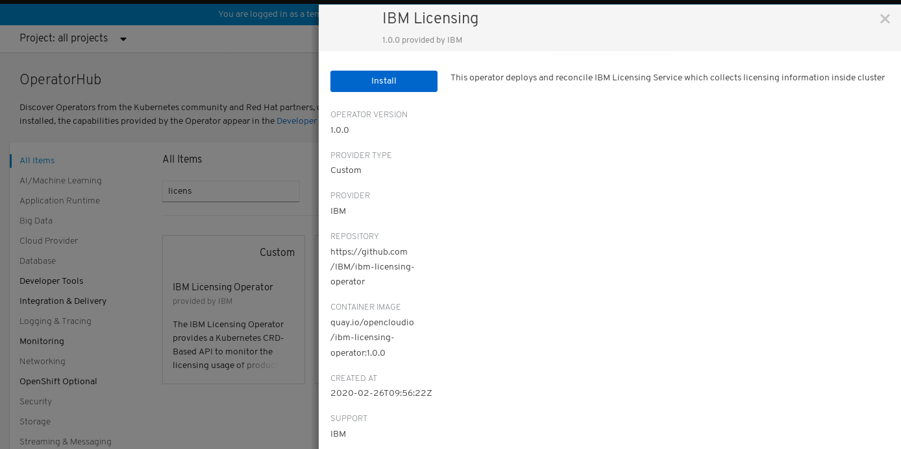
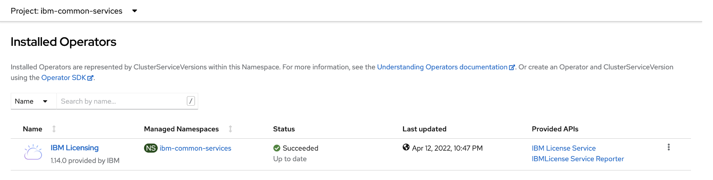

# IBM Licensing Operator

**IBM Licensing Operator** installs **IBM License Service**.

**IBM License Service** is a tool that collects information about license usage of IBM products on a cluster where it is deployed, including IBM Cloud Paks, and stand-alone containerized IBM software.
Using an API call, you can retrieve the license usage of your products and generate an audit snapshot.
**IBM License Service** ,as a part of IBM Cloud Platform Common Services, is integrated in IBM Cloud Paks. The Operator can also install the service with Operator Lifecycle Manager separately for stand-alone containerized IBM software.

## Operator versions and supported platforms

List the platforms and operation systems on which the operator is supported.

|Operator version|Date|Supported operating systems|Supported platforms|Details|
|---|---|---|---|---|
|1.0.0| 03/2020|AMD64|<ul><li>[OpenShift Container Platform](https://www.openshift.com/) 4.2 or higher</li><br></br><li>Kubernetes 1.11.3 or higher</li></ul>|First release |

## Documentation

For information about installation and configuration as a part of IBM Cloud Platform Services, see the [IBM Cloud Platform Common Services documentation](http://ibm.biz/cpcsdocs)

## Developer guide

<!-- START doctoc generated TOC please keep comment here to allow auto update -->
<!-- DON'T EDIT THIS SECTION, INSTEAD RE-RUN doctoc TO UPDATE -->
**Table of Contents**  *generated with [DocToc](https://github.com/thlorenz/doctoc)*

- [Installing IBM Licensing Operator as a part of IBM Cloud Platform Common Services on OpenShift](#installing-ibm-licensing-operator-as-a-part-of-ibm-cloud-platform-common-services-on-openshift)
- [Installing IBM Licensing Operator with stand-alone containerized IBM products using `Operator Lifecycle Manager`(OLM)](#installing-ibm-licensing-operator-with-stand-alone-containerized-ibm-products-using-operator-lifecycle-managerolm)
    - [Install the IBM Licensing Operator On OCP 4.2+](#install-the-ibm-licensing-operator-on-ocp-42)
    - [Install the IBM Licensing Operator on Kubernetes from scratch with `kubectl`](#install-the-ibm-licensing-operator-on-kubernetes-from-scratch-with-kubectl)
- [Post-installation steps](#post-installation-steps)
    - [Create instance on OCP 4.2+](#create-instance-on-ocp-42)
    - [Creating an instance from console](#creating-an-instance-from-console)
    - [Check Components](#check-components)
- [Using IBM License Service to retrieve license usage information](#using-ibm-license-service-to-retrieve-license-usage-information)
- [Uninstalling from any kubernetes cluster](#uninstalling-from-any-kubernetes-cluster)
- [Troubleshoot](#troubleshoot)
    - [CreateContainerConfigError Marketplace Operator error](#createcontainerconfigerror-marketplace-operator-error)

<!-- END doctoc generated TOC please keep comment here to allow auto update -->

### Installing IBM Licensing Operator as a part of IBM Cloud Platform Common Services on OpenShift

**Prerequisites**
Install all the following operators that IBM Licensing Operator depends on:
- ibm-cert-manager-operator
- ibm-licensing-operator
- ibm-metering-operator
- ibm-mongodb-operator

**Installation**
For the installation steps, see: [Installing IBM Cloud Platform Services in your OpenShift Container Platform cluster](https://www-03preprod.ibm.com/support/knowledgecenter/SSHKN6/installer/3.3.0/install_operator.html).

### Installing IBM Licensing Operator with stand-alone containerized IBM products using `Operator Lifecycle Manager`(OLM)

#### Install the IBM Licensing Operator On OCP 4.2+

**Prerequisites**
- Administrator permissions for the cluster

1\. **Create OperatorSource**

Before you install IBM Licensing Operator, the following `operator source` should be created to get operator bundles from `quay.io`.

```yaml
apiVersion: operators.coreos.com/v1
kind: OperatorSource
metadata:
  name: opencloud-operators
  namespace: openshift-marketplace
spec:
  authorizationToken: {}
  displayName: IBMCS Operators
  endpoint: https://quay.io/cnr
  publisher: IBM
  registryNamespace: opencloudio
  type: appregistry
```

To add the OpenSource, log in to OpenShift Console and click the plus button on the right hand site of the header, and then copy the above operator source into the editor.

2\. **Create the `ibm-common-services` namespace**

Open the `OperatorHub` page in the OCP console left menu, and `Create Project` named `ibm-common-services`.


3\. **Install `IBM Licensing Operator` package in OperatorHub**

    a. Open `OperatorHub` and search for `IBM Licensing Operator`.

    b. Select `IBM Licensing Operator` and click **Install**.


    c. As **A specific namespace on the cluster** select `ibm-common-services` that you created in the previous step, and click subscribe.


Waite for about 1 minute, and click **Installed operators**. You should see IBM Licensing Operator in the `InstallSucceeded` status.


#### Install the IBM Licensing Operator on Kubernetes from scratch with `kubectl`

**Prerequisites**
- Administrator permissions for the cluster
- 'kubectl` 1.11.3 or higher
- Linux or iOS
    **Note**: To install on Windows, change the commands to fit the Windows standard.

1\. **Install the Operator Lifecycle Manager**

Make sure that you are connected to your cluster. You can, for example, run the following command:

```bash
kubectl get node
```

You should get a list of your nodes in response.

Download OLM Release from [here](https://github.com/operator-framework/operator-lifecycle-manager/releases)

**Note:** For versions newer than 13.0 process might differ. Use the following script to install OLM v13.0:

```bash
curl -sL https://github.com/operator-framework/operator-lifecycle-manager/releases/download/0.13.0/install.sh | bash -s 0.13.0
```

If you get an error, you might have old Kubernetes version. You can try either upgrading your kubernetes server version or using older version of OLM.

2\. **Install the Operator Marketplace**

Clone the following github repo:

```bash
git clone --single-branch --branch release-4.6 https://github.com/operator-framework/operator-marketplace.git
```

Change the `marketplace` namespace to `olm` to be able to create subscriptions to the operatorsource/catalogsource from different namespace.
If cluster's `global catalog namespace` is different than `olm`, complete the following steps to change it.
You can check you `global catalog namespace` at OLM `packageserver` pod yaml somewhere in your cluster, using `grep global-namespace`.

For **Linux** users:

```bash
# change this value if this would not be olm
export GLOBAL_CATALOG_NAMESPACE=olm
# change all resources namespace to olm
sed -i 's/namespace: .*/namespace: '"${GLOBAL_CATALOG_NAMESPACE}"'/g' operator-marketplace/deploy/upstream/*
# change namespace to olm
sed -i 's/name: .*/name: '"${GLOBAL_CATALOG_NAMESPACE}"'/g' operator-marketplace/deploy/upstream/01_namespace.yaml
```

For **MAC** users:

```bash
export GLOBAL_CATALOG_NAMESPACE=olm
sed -i "" 's/namespace: .*/namespace: '"${GLOBAL_CATALOG_NAMESPACE}"'/g' operator-marketplace/deploy/upstream/*
sed -i "" 's/name: .*/name: '"${GLOBAL_CATALOG_NAMESPACE}"'/g' operator-marketplace/deploy/upstream/01_namespace.yaml
```

Install the Operator Marketplace into the cluster in the `$GLOBAL_CATALOG_NAMESPACE` namespace:

```bash
kubectl apply -f operator-marketplace/deploy/upstream
```

If you get `unknown field "preserveUnknownFields"` error, try to delete preserveUnknownFields from yaml files inside `operator-marketplace/deploy/upstream/` catalog or consider upgrading kubernetes server version:

For **Linux** users:

```bash
sed -i '/.*preserveUnknownFields.*/d' operator-marketplace/deploy/upstream/*
kubectl apply -f operator-marketplace/deploy/upstream
```

For **MAC** users:

```bash
sed -i "" '/.*preserveUnknownFields.*/d' operator-marketplace/deploy/upstream/*
kubectl apply -f operator-marketplace/deploy/upstream
```

3\. **Create the OperatorSource**

An `OperatorSource` object is used to define the external datastore that is used to store operator bundles. More information including examples can be found in the documentation included in the `operator-marketplace` [repository](https://github.com/operator-framework/operator-marketplace#operatorsource).

Create `operator source` to get operator bundles from `quay.io`.

```yaml
cat <<EOF | kubectl apply -f -
apiVersion: operators.coreos.com/v1
kind: OperatorSource
metadata:
  name: opencloud-operators
  namespace: $GLOBAL_CATALOG_NAMESPACE
spec:
  authorizationToken: {}
  displayName: IBMCS Operators
  endpoint: https://quay.io/cnr
  publisher: IBM
  registryNamespace: opencloudio
  type: appregistry
EOF
```

The `operator-marketplace` controller should successfully process this object (status should have value Succeeded):

```console
$ kubectl get operatorsource opencloud-operators -n $GLOBAL_CATALOG_NAMESPACE
NAME                  TYPE          ENDPOINT              REGISTRY      DISPLAYNAME       PUBLISHER   STATUS      MESSAGE                                       AGE
opencloud-operators   appregistry   https://quay.io/cnr   opencloudio   IBMCS Operators   IBM         Succeeded   The object has been successfully reconciled   1m32s
```

Additionally, a `CatalogSource` is created in the `$GLOBAL_CATALOG_NAMESPACE` namespace:

```console
$ kubectl get catalogsource -n $GLOBAL_CATALOG_NAMESPACE
NAME                           DISPLAY                        TYPE   PUBLISHER   AGE
opencloud-operators            IBMCS Operators                grpc   IBM         20m
[...]
```

If everything goes well, you should see the following pods:

```console
$ kubectl get pod -n $GLOBAL_CATALOG_NAMESPACE
NAME                                            READY   STATUS    RESTARTS   AGE
marketplace-operator-6576b4ddc8-dqcgr           1/1     Running   0          84s
opencloud-operators-66df4d97ff-4rhjj            1/1     Running   0          80s
upstream-community-operators-7ffb6b674b-7qlvx   1/1     Running   0          80s
[...]
```

If something seems wrong check the [troubleshoot section](#createcontainerconfigerror-marketplace-operator-error)

4\. **View Available Operators**

Once the `OperatorSource` and `CatalogSource` are deployed, the following command can be used to list the available operators including ibm-licensing-operator-app.

 The following command assumes `opencloud-operators` as the name of the `OperatorSource` object. Adjust accordingly.

```console
$ kubectl get opsrc opencloud-operators -o=custom-columns=NAME:.metadata.name,PACKAGES:.status.packages -n $GLOBAL_CATALOG_NAMESPACE
NAME                  PACKAGES
opencloud-operators   ibm-meta-operator-bridge-app,ibm-commonui-operator-app,ibm-catalog-ui-operator-app,ibm-metering-operator-app,ibm-helm-repo-operator-app,ibm-iam-operator-app,ibm-elastic-stack-operator-app,ibm-monitoring-exporters-operator-app,ibm-monitoring-prometheusext-operator-app,cp4foobar-operator-app,ibm-healthcheck-operator-app,ibm-platform-api-operator-app,ibm-management-ingress-operator-app,ibm-helm-api-operator-app,ibm-licensing-operator-app,ibm-ingress-nginx-operator-app,ibm-monitoring-grafana-operator-app,ibm-auditlogging-operator-app,operand-deployment-lifecycle-manager-app,ibm-mgmt-repo-operator-app,ibm-mongodb-operator-app,ibm-cert-manager-operator-app
```

5\. **Create an OperatorGroup**

An `OperatorGroup` is used to denote which namespaces your Operator should be watching.
It must exist in the namespace where your operator is deployed, for example, `ibm-common-services`.

Create a namespace for `IBM Licensing Operator`:

```bash
kubectl create namespace ibm-common-services
```

Deploy the `OperatorGroup` resource:

```yaml
cat <<EOF | kubectl apply -f -
apiVersion: operators.coreos.com/v1alpha2
kind: OperatorGroup
metadata:
  name: operatorgroup
  namespace: ibm-common-services
spec:
  targetNamespaces:
  - ibm-common-services
EOF
```

6\. **Create a Subscription**

 The last piece ties together all of the previous steps. A `Subscription` is created to the operator and it upgrades `IBM Licensing Operator` when needed.
 Create the `Subscription` using the following command:

```yaml
cat <<EOF | kubectl apply -f -
apiVersion: operators.coreos.com/v1alpha1
kind: Subscription
metadata:
  name: ibm-licensing-operator-app
  namespace: ibm-common-services
spec:
  channel: stable-v1
  name: ibm-licensing-operator-app
  source: opencloud-operators
  sourceNamespace: $GLOBAL_CATALOG_NAMESPACE
EOF
```

7\. **Verify Operator health**

Watch `IBM Licensing Operator` being deployed by `OLM` from the `catalog source` created by `Operator Marketplace` with the following command:

```console
$ kubectl get clusterserviceversion -n ibm-common-services
NAME                            DISPLAY                  VERSION   REPLACES                        PHASE
ibm-licensing-operator.v1.0.0   IBM Licensing Operator   1.0.0     ibm-licensing-operator.v0.0.0   Succeeded
```

**Note:** The above command assumes that you have created the `Subscription` in the `ibm-common-services` namespace.
If your Operator deployment (CSV) shows `Succeeded` in the `InstallPhase` status, your Operator is deployed successfully. If that's not the case check the `ClusterServiceVersion` objects status for details.

Optional: You can also check your Operator's deployment:

```bash
kubectl get deployment -n ibm-common-services | grep ibm-licensing-operator
```

### Post-installation steps

After you successfully install IBM Licensing Operator, you can create IBMLicensing instance that will make IBM Licensing Service run on cluster.

#### Create instance on OCP 4.2+

If you have OCP 4.2+ you can create the instance from the OCP UI: **Installed Operators->IBM Licensing Operator->IBM Licensing tab->Create IBMLicensing**


By clicking `Create IBMLicensing`, you can edit your parameters.

**Note:** Make sure to change datasource to `datacollector`.

[OCP instance datacollector](images/ocp_instance_datacollector.png)

For more information about the parameters, see [IBMLicensingOperatorParameters](images/IBMLicensingOperatorParameters.csv).

If you are sure about your parameters click **Create**.
To edit your instance in the future, go to:
**OCP UI->Administration->Custom Resource Definitions->select IBMLicensing->instances->Edit IBMLicensing**

[OCP Edit Instance](images/ocp_edit_instance.png)

**Note**: If the instance is not updated properly, try deleting the instance and creating new one with new parameters.

#### Creating an instance from console

Minimal setup requires applying this IBMLicensing instance:

```yaml
cat <<EOF | kubectl apply -f -
apiVersion: operator.ibm.com/v1alpha1
kind: IBMLicensing
metadata:
  name: instance
spec:
  apiSecretToken: ibm-licensing-token
  datasource: datacollector
  httpsEnable: true
  instanceNamespace: ibm-common-services
EOF
```

But you might want to configure ingress, here is example for how to do it:
- You have nginx ingress controller, for example from here: [https://kubernetes.github.io/ingress-nginx/deploy](https://kubernetes.github.io/ingress-nginx/deploy)
- Apply this IBMLicensing instance to your cluster:

```yaml
cat <<EOF | kubectl apply -f -
apiVersion: operator.ibm.com/v1alpha1
kind: IBMLicensing
metadata:
  name: instance
spec:
  apiSecretToken: ibm-licensing-token
  datasource: datacollector
  httpsEnable: false
  instanceNamespace: ibm-common-services
  ingressEnabled: true
  ingressOptions:
    annotations:
      "nginx.ingress.kubernetes.io/rewrite-target": "/$2"
    path: /ibm-licensing-service-instance/(/|$)(.*)
EOF
```

- then you will be able to access it at your ingress host with path `/ibm-licensing-service-instance`

\* For HTTPS you may need to set spec.httpsEnable to true, and edit ingressOptions. Read more about options here:
[IBMLicensingOperatorParameters](images/IBMLicensingOperatorParameters.csv)

#### Check Components

First check if pod is created.
You can see the logs at OCP UI->Workloads->Pods->search for `licensing` in `ibm-common-services` project:


Check if pod is running, for further investigating you can click it to check logs, and events.

From console you can use:

```bash
podName=`kubectl get pod -n ibm-common-services -o jsonpath="{range .items[*]}{.metadata.name}{'\n'}" | grep ibm-licensing-service-instance`
kubectl logs $podName -n ibm-common-services
kubectl describe pod $podName -n ibm-common-services
```

You can also check OCP UI->Networking->Service,Route*

\* or Ingress if you changed instance parameters

From console you can use for example this to check Ingress:

```bash
kubectl get ingress -n ibm-common-services -o yaml
```

### Using IBM License Service to retrieve license usage information

See the License Service section in the [IBM Cloud Platform Common Services documentation](http://ibm.biz/cpcsdocs).

### Uninstalling from any kubernetes cluster

These steps assume you have deployed IBM Licensing Service in ibm-common-services namespace

<b>1. Delete IBMLicensing custom resource</b>

Delete instance after which operator should clean its resources.
Check what ibmlicensing instances you have:

```bash
licensingNamespace=ibm-common-services
kubectl get ibmlicensing -n ${licensingNamespace} -o jsonpath="{range .items[*]}{.metadata.name}{'\n'}"
```

Above command should return one instance. Delete it if exists:

```bash
licensingNamespace=ibm-common-services
instanceName=`kubectl get ibmlicensing -n ${licensingNamespace} -o jsonpath="{range .items[*]}{.metadata.name}{'\n'}"`
kubectl delete ibmlicensing ${instanceName} -n ${licensingNamespace}
```

<b>2. Delete subscription</b>

Show subscriptions with:

```bash
licensingNamespace=ibm-common-services
kubectl get subscription -n ${licensingNamespace} -o jsonpath="{range .items[*]}{.metadata.name}{'\n'}"
```

Delete ibm-licensing-operator-app subscription:

```bash
licensingNamespace=ibm-common-services
subName=ibm-licensing-operator-app
kubectl delete subscription ${subName} -n ${licensingNamespace}
```

<b>3. Delete CSV</b>

Delete CSV that manages Operator image.
Get your CSV name, look for ibm-licensing-operator:

```bash
licensingNamespace=ibm-common-services
kubectl get clusterserviceversion -n ${licensingNamespace} -o jsonpath="{range .items[*]}{.metadata.name}{'\n'}"
kubectl get clusterserviceversion -n ${licensingNamespace} -o jsonpath="{range .items[*]}{.metadata.name}{'\n'}" | grep ibm-licensing-operator
```

Delete it:

```bash
licensingNamespace=ibm-common-services
csvName=`kubectl get clusterserviceversion -n ${licensingNamespace} -o jsonpath="{range .items[*]}{.metadata.name}{'\n'}" | grep ibm-licensing-operator`
kubectl delete clusterserviceversion ${csvName} -n ${licensingNamespace}
```

<b>4. Delete CRD</b>

Delete custom resource definition

```bash
kubectl delete CustomResourceDefinition ibmlicensings.operator.ibm.com
```

<b>5. Delete OperatorGroup</b>

If you also have other subscriptions tied with that operatorGroup do not delete it.
IBM Licensing Operator should be uninstalled now but you can also cleanup operatorgroup you created for subscription:

```bash
licensingNamespace=ibm-common-services
operatorGroupName=operatorgroup
kubectl delete OperatorGroup ${operatorGroupName} -n ${licensingNamespace}
```

<b>6. Delete OperatorSource</b>

If you have other services using opencloudio catalog source do not delete the OperatorSource.
Otherwise if you want to delete it use:

```bash
export GLOBAL_CATALOG_NAMESPACE=olm
opencloudioSourceName=opencloud-operators
kubectl delete OperatorSource ${opencloudioSourceName} -n ${GLOBAL_CATALOG_NAMESPACE}
```

<b>7. Delete OperatorMarketplace</b>

WARNING!!! Make sure you are not using it elsewhere.

```bash
export GLOBAL_CATALOG_NAMESPACE=olm
kubectl delete -f operator-marketplace/deploy/upstream
```

<b>8. Uninstall OLM</b>

WARNING!!! Make sure you are not using it elsewhere.

```bash
export GLOBAL_CATALOG_NAMESPACE=olm
kubectl delete crd clusterserviceversions.operators.coreos.com \
installplans.operators.coreos.com \
subscriptions.operators.coreos.com \
catalogsources.operators.coreos.com \
operatorgroups.operators.coreos.com
kubectl delete namespace ${GLOBAL_CATALOG_NAMESPACE}
```

### Troubleshoot

#### CreateContainerConfigError Marketplace Operator error

If something goes wrong while installing operator-marketplace look for pods in marketplace.
If you see error like this:

```console
$ kubectl get pod -n $GLOBAL_CATALOG_NAMESPACE
NAME                                    READY   STATUS                       RESTARTS   AGE
marketplace-operator-7d4c5bdb5-mxsj6    0/1     CreateContainerConfigError   0          1m36s
```

You can check what the problem is using yaml (using your pod name)

```bash
kubectl get pod marketplace-operator-7d4c5bdb5-mxsj6 -n $GLOBAL_CATALOG_NAMESPACE -o yaml
```

If it will show error like `container has runAsNonRoot and image has non-numeric user (marketplace-operator), cannot verify user is non-root`
in status, You can fix it by adding securityContext to operator-marketplace/deploy/upstream:

```console
vim operator-marketplace/deploy/upstream/08_operator.yaml
```

Then append lines mentioned here:

```yaml
...
      containers:
        - name: marketplace-operator
          securityContext: # <- this
            runAsUser: 65534 # <- and this
          image: quay.io/openshift/origin-operator-marketplace:latest
...
```

And then apply the configuration:

```bash
kubectl apply -f operator-marketplace/deploy/upstream/08_operator.yaml
```
