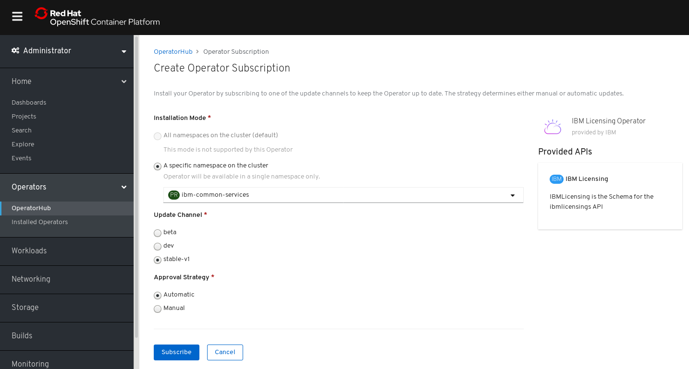

<!-- START doctoc generated TOC please keep comment here to allow auto update -->
<!-- DON'T EDIT THIS SECTION, INSTEAD RE-RUN doctoc TO UPDATE -->
**Table of Contents**  *generated with [DocToc](https://github.com/thlorenz/doctoc)*

- [IBM Licensing Operator](#ibm-licensing-operator)
    - [Overview](#overview)
    - [Installation](#installation)
        - [Install the IBM Licensing Operator On OCP 4.2+](#install-the-ibm-licensing-operator-on-ocp-42)
            - [1. Create OperatorSource](#1-create-operatorsource)
            - [2. Create a Namespace `ibm-common-services`](#2-create-a-namespace-ibm-common-services)
            - [3. Install `IBM Licensing Operator` Package in the OperatorHub](#3-install-ibm-licensing-operator-package-in-the-operatorhub)
        - [Install the IBM Licensing Operator on Kubernetes from scratch](#install-the-ibm-licensing-operator-on-kubernetes-from-scratch)
            - [1. Install Operator Lifecycle Manager](#1-install-operator-lifecycle-manager)

<!-- END doctoc generated TOC please keep comment here to allow auto update -->

# IBM Licensing Operator

In this document, we will show you how to deploy and use <b>IBM Licensing Service</b> inside your Cluster
using Operator Lifecycle Manager.

## Overview

- <b>IBM Licensing Service</b> is a tool that collects licensing data from IBM Products across all cluster.
 It provides API to see the usage and generate Audit Snapshots.
- You can read more about Operators and Operator Lifecycle Manager [here](https://github.com/operator-framework/operator-lifecycle-manager)

## Installation

IBM Licensing Operator can be installed either on vanilla kubernetes, or on [OpenShift Container Platform](https://www.openshift.com/).
It is also a part of bigger project called IBM Cloud Platform Common Services, and could be installed with other Services using [operand-deployment-lifecycle-manager](https://github.com/IBM/operand-deployment-lifecycle-manager)

- If You have OpenShift Container Platform with Version 4.2+ install with [this](#install-the-ibm-licensing-operator-on-ocp-42)
- Otherwise on you can install it with [this]()

### Install the IBM Licensing Operator On OCP 4.2+

#### 1. Create OperatorSource

Before install IBM Licensing Operator, this operator source should be created to get operator bundles from `quay.io`.

```yaml
apiVersion: operators.coreos.com/v1
kind: OperatorSource
metadata:
  name: opencloud-operators
  namespace: openshift-marketplace
spec:
  authorizationToken: {}
  displayName: IBMCS Operators
  endpoint: https://quay.io/cnr
  publisher: IBM
  registryNamespace: opencloudio
  type: appregistry
```

Click the plus button, and then copy the above operator source into the editor.


#### 2. Create a Namespace `ibm-common-services`

Open the `OperatorHub` page in OCP console left menu, then `Create Project` named `ibm-common-services`.


#### 3. Install `IBM Licensing Operator` Package in the OperatorHub

Open `OperatorHub` and search `IBM Licensing Operator` to find the operator,
and install it by clicking install.


Select specific namespace `ibm-common-services` that was created in step [Create Project](#2-create-a-namespace-ibm-common-services) and click subscribe.


Now after waiting about 1 minute and clicking installed operators you should see IBM Licensing Operator and it should have status `InstallSucceeded`


### Install the IBM Licensing Operator on Kubernetes from scratch

#### 1. Install Operator Lifecycle Manager

Make sure You are connected to your cluster f.e. using:

```bash
kubectl get node
# check if this shows your nodes
```

Download latest OLM Release from [here](https://github.com/operator-framework/operator-lifecycle-manager/releases)
For example if you want version 14.1 you can execute this shell script:

```bash
curl -sL https://github.com/operator-framework/operator-lifecycle-manager/releases/download/0.14.1/install.sh | bash -s 0.14.1
```

<!--TODO: finish this --->