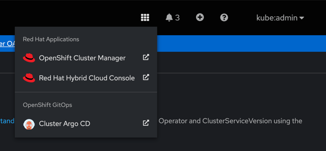
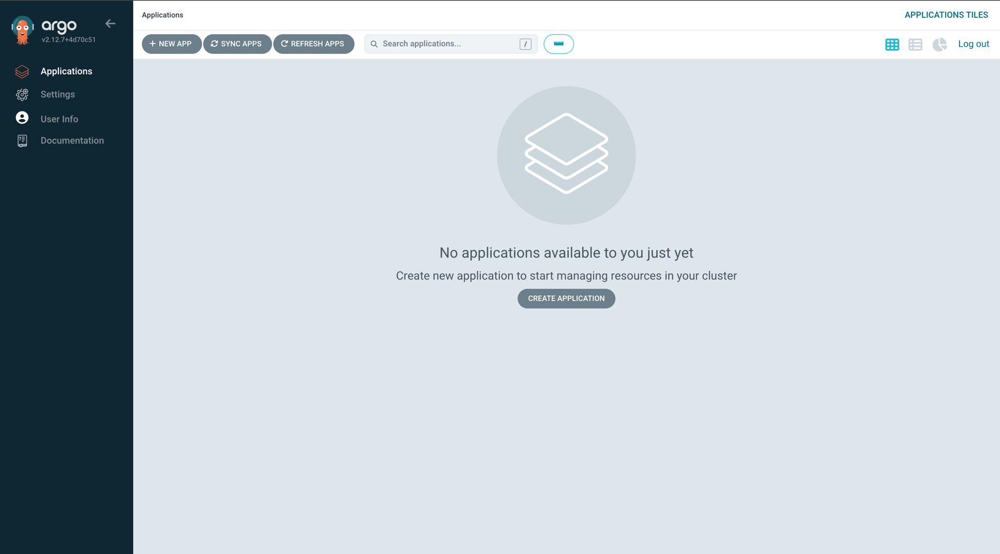
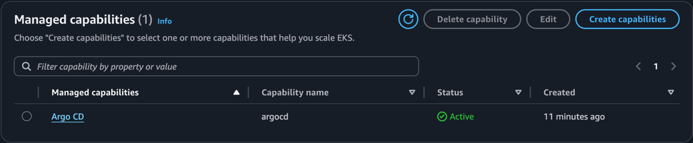
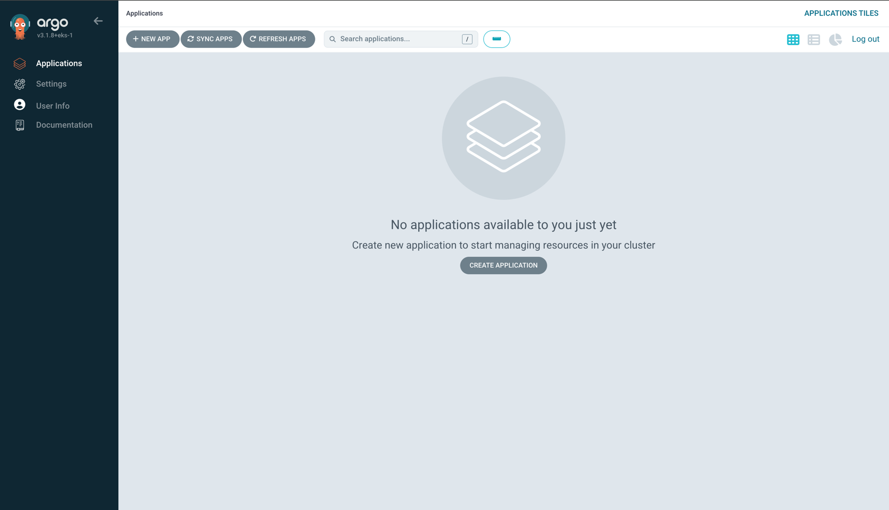
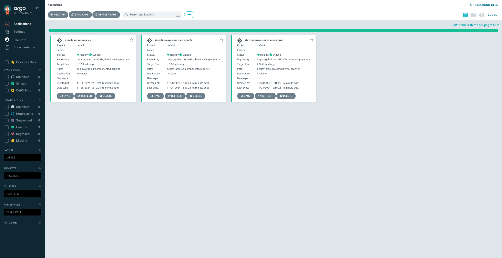

# Installing IBM Licensing components as Argo CD applications

Learn how to install IBM Licensing components as Argo CD applications. This procedure guides you through the following steps:

- [Prerequisites](#prerequisites): Preparing for the installation.
- [Configuring](#configuring) (optional): Configuring the components to ensure that the Licensing suite is functional.
- [Installing](#installing): Installation of IBM License Service and IBM License Service Reporter.

## Prerequisites

Before you can deploy Argo CD applications:

- You must have a cluster with Argo CD installed.
- ArgoCD application controller must have all required permissions. See the [prerequisites directory](prerequisites).

Perform the following steps to provision and configure a cluster for IBM Licensing components.

### 1. Install Argo CD

#### On an Openshift cluster

1.1. Log in to the OpenShift console and go to **Operators > OperatorHub** or **Ecosystem > Software Catalog** depending on the version of your console. Install *Red Hat OpenShift GitOps*. For more information, see [RedHat documentation](https://docs.openshift.com/gitops/1.14/installing_gitops/installing-openshift-gitops.html).

1.2. To access the *Argo CD* user interface, click the Application Launcher icon in the top-right corner, and click **Cluster Argo CD**:
    

1.3. Log in via *OpenShift* and check whether the Applications screen is accessible.
    

#### On EKS

1.1. Install *Argo CD* by following the official [AWS documentation](https://docs.aws.amazon.com/eks/latest/userguide/argocd.html).

1.2. Access *Argo CD* user interface:
    

1.3. Log in with the IAM Identity Center user and check whether the Applications screen is accessible.
    

### 2. Apply prerequisites

You can apply prerequisites in multiple ways. It is recommended for the cluster administrators to review and apply the required modifications manually. However, it can also be automated.

#### Apply the .yaml files

Log in to the cluster and run the following command on the `prerequisites` directory to apply prerequisites for the IBM Licensing components.

```shell
kubectl apply -f <path-to-cloned-repo>/prerequisites --recursive
```

**Note:** Some values, such as namespaces or annotations, might need adjustment depending on your desired results.

#### Include prerequisites as a part of your Argo CD deployment

To automate the deployment of prerequisites, include the .yaml files from the `prerequisites` directory in your
Argo CD applications' paths. To make sure that they are applied before the IBM Licensing components are installed,
you can use [sync waves](https://argo-cd.readthedocs.io/en/latest/user-guide/sync-waves/). For example, through
annotating the required resources with the `PreSync` phase.

## Configuring

### Configuring by adjusting yaml files

It is recommended to adjust the `Application` .yaml files to configure the `helm` charts of the components. For more
information, see the [Argo CD user guide](https://argo-cd.readthedocs.io/en/latest/user-guide/helm/) on `helm`.

In general, for applications with multiple sources, the modifications are introduced with the following structure:

```yaml
sources:
  - helm:
      valuesObject:
        key: new-value
```

Alternatively, you can adjust the .yaml files within the `components` directory itself or the `values.yaml`
files, before deploying an `Application` targeting them. For example, you can fork this repository and adjust
some custom resource configuration directly in the relevant file.

### Configuring through CR

To configure the Licensing components through custom resources, modify the `spec` section. For example, to enable
hyper-threading in License Service, add the following lines:

```yaml
helm:
  valuesObject:
    spec:
      features:
        hyperThreading:
          threadsPerCore: <number of threads>
```

To learn more about the supported configuration options, see the official documentation for License Service and License Service Reporter. See the relevant sections under the following links:

- [*License Service*](https://www.ibm.com/docs/en/cloud-paks/foundational-services/4.x_cd?topic=service-configuring)
- [*License Service Reporter*](https://www.ibm.com/docs/en/cloud-paks/foundational-services/4.x_cd?topic=reporter-installing-configuring-license-service)

### Configurable properties

The following are some common scenarios with examples on how to resolve the provided sample issues.

**Note:** Apply the following examples to the following sources:

- For License Service, apply the examples to the `helm-cluster-scoped` source that supports full CR configuration.
- For License Service Reporter, apply the examples to the sources that targets the path with `helm`, not `helm-cluster-scoped`, as
the cluster-scoped charts only support the `namespace` parameter

#### Changing the target namespace

<details>
<summary>Click to expand</summary>

By default, IBM Licensing components are installed in three different namespaces to separate the resources, and
group them by the component. If you want to install a specific component in a different namespace, change the following lines:

```yaml
helm:
  valuesObject:
    namespace: my-custom-namespace
```

**Note:** When you change the `namespace` value in `applications/license-service.yaml`, in general, you should also modify the value of the `watchNamespace` parameter.

</details>

#### Applying custom metadata

<details>
<summary>Click to expand</summary>

- To apply custom labels and annotations to the operator-managed resources, change the following lines:

  ```yaml
  helm:
    valuesObject:
      spec:
        labels:
          appName: LicenseService
        annotations:
          companyName: IBM
  ```

- To apply custom labels and annotations to the operator deployment, change the following lines:

  ```yaml
  helm:
    valuesObject:
      operator:
        labels:
          appName: LicenseService
        annotations:
          companyName: IBM
  ```

**Note:** Custom labels and annotations are additions to the default ones, and they do not override them.

</details>

#### Specifying image registry and image registry namespace

<details>
<summary>Click to expand</summary>

To specify a different image registry for the installation of the components, change the value of `global.imagePullPrefix` in the relevant `Application.yaml` file:

```yaml
helm:
  valuesObject:
    global:
      imagePullPrefix: <your-registry>
```

As a result, the operator and operand image registries are overwritten. For example, after applying the above changes to the `applications/license-service.yaml` file, the image of the `ibm-licensing-operator` becomes `<your-registry>/cpopen/ibm-licensing-operator:4.2.20`.

To additionally modify the image registry namespace of either the operator or the operand, change the value of `cpfs.imageRegistryNamespaceOperator` or `cpfs.imageRegistryNamespaceOperand`, or both, in the relevant `Application.yaml` file:

```yaml
helm:
  valuesObject:
    cpfs:
      imageRegistryNamespaceOperator: <your-operator-image-registry-namespace>
      imageRegistryNamespaceOperand: <your-operand-image-registry-namespace>
```

As a result, the operator and operand image registry namespaces are overwritten. For example, after applying the above changes to the `applications/license-service.yaml` file, the image of the `ibm-licensing-operator` becomes `icr.io/<your-operator-image-registry-namespace>/ibm-licensing-operator:4.2.20`.

**Note:** `global.imagePullPrefix`, `cpfs.imageRegistryNamespaceOperator` and `cpfs.imageRegistryNamespaceOperand` take precedence over any values that you provided in the CR configuration, for example, through `spec.imageRegistry`.

</details>

#### Specifying image pull secrets

<details>
<summary>Click to expand</summary>

To specify which image pull secret should be used to pull from the registry, change the value of `global.imagePullSecret` in the relevant `Application.yaml` file:

```yaml
helm:
  valuesObject:
    global:
      imagePullSecret: <your-secret>
```

As a result, the `imagePullSecrets` field of the operator and the operand include the specified secret, and this secret is used when pulling the images from the registry.

**Note:** `global.imagePullSecret` is added to the list of secrets provided in the CR configuration, for example, through `spec.imagePullSecrets`.

</details>

## Installing

### Installing all components

To install all components, perform the following steps.

1. Log in to your cluster, and open the following namespace.

- For OpenShift, by default `openshift-gitops`
- For EKS, by default `argocd`

  ```shell
  kubectl project shift-gitops
  ```

2. Run the following command.

    ```shell
    kubectl apply -f <path-to-cloned-repo>/applications
    ```

**Note** Remember to `sync` after the applications are applied, or add the `auto-sync` option to your setup.

You should see the apps in Argo CD.


### Installing selected components

To install selected components separately, for example to install *IBM License Service* only, perform the following steps.

1. Log in to your cluster, and open the following namespace.

- For OpenShift, by default `openshift-gitops`
- For EKS, by default `argocd`

  ```shell
  kubectl project shift-gitops
  ```

2. Run the following command.

    ```shell
    kubectl apply -f<path-to-cloned-repo>/applications/license-service.yaml
    ```

**Note:** Remember to `sync` after the applications are applied, or add the `auto-sync` option to your setup.

### Installing on EKS clusters

You must register your cluster and modify the `server` field of your `Application`, because the default local cluster
destination is not supported. Follow official [AWS documentation](<https://docs.aws.amazon.com/eks/latest/userguide/argocd-register-clusters.html>) to
register your cluster.

You will also need to configure the right roles and permissions so that your ArgoCD instance can sync the application.

### Separate installation scenario

Installing components separately is recommended, for example, when you want to install *IBM License Service Reporter* on a different cluster.

In such scenario, complete the following steps:

1. Apply `applications/reporter.yaml` to your cluster.
2. Follow the official *IBM License Service* documentation to prepare the connection secret and CR configuration.
3. Add the values to `applications/license-service.yaml` to configure the connection.
4. Apply `applications/license-service.yaml` to your cluster and check whether both components are working and are
connected.

### Installation with helm

Helm installation support is in its alpha stage. To install the Licensing components with helm, run the following commands:

- IBM License Service:

**Note:** License Service supports only cluster-scoped installation and only has a `helm-cluster-scoped` chart.

```commandline
helm install license-service ./components/license-service/helm-cluster-scoped
```

- IBM License Service Reporter:

```commandline
helm install reporter-cluster-scoped ./components/reporter/helm-cluster-scoped
helm install reporter ./components/reporter/helm
```

Commands such as `helm upgrade` should be functional. However, due to the alpha stage of the development, they can
result in an unexpected state. Therefore, it is recommended to perform installation on a clean-state cluster.

If you already have any Licensing components installed, use the `--take-ownership` flag, which is introduced in
`helm` version `3.17.0`, when running the `install` commands.
