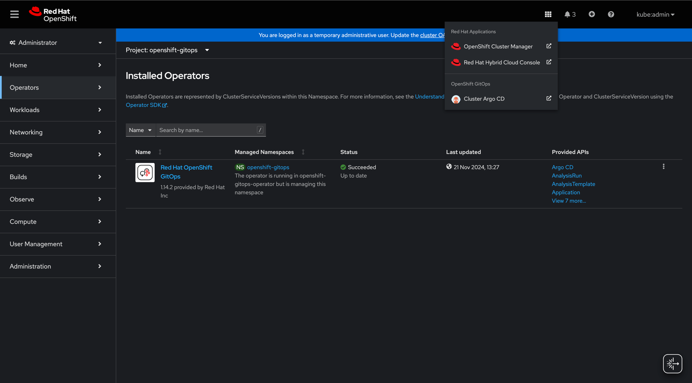

# Installing IBM Licensing components as Argo CD applications

Learn how to install IBM Licensing components as Argo CD applications and perform post-installation configuration.

The following procedure guides you through the following steps:
- Installation of IBM License Service (ILS), IMB License Srvice Reporter and IBM License Service Scanner.
- Configuration of the components to ensure that the whole Licensing suite is functional.

**Note:** IBM License Service Scanner is a new Beta solution that is not yet publicly available.

## Prerequisites

Before you can deploy Argo CD applications:
- You must have a cluster with Argo CD installed.
- ArgoCD application controller must have all required permissions. See the [prerequisites directory](prerequisites).

The following are the instructions on how to provision and configure a cluster for IBM Licensing components.

### Install Argo CD on an Openshift cluster

- Install *Red Hat OpenShift GitOps* from the *OperatorHub* (see
[RedHat documentation](https://docs.openshift.com/gitops/1.14/installing_gitops/installing-openshift-gitops.html)
for more information):
    
    

- Access *Argo CD* UI:
    
    

- Log in via *OpenShift* and check whether the Applications screen is accessible:
    

### Apply prerequisites

There are multiple ways to apply prerequisites in your cluster. We recommend, that the cluster admins review and apply
the required modifications manually. However, this can also be automated.

#### Apply the .yaml files

Assuming that you are logged in to the cluster, you can apply all prerequisites that are required for IBM Licensing
components with a simple command executed on the `prerequisites` directory:

```shell
oc apply -f prerequisites --recursive
```

Note that some values, such as namespaces or annotations, may need adjustment depending on your desired results.

#### Include prerequisites as a part of your Argo CD deployment

To automate prerequisites deployment, you can include the .yaml files from the `prerequisites` directory in your
Argo CD applications' paths. To make sure that they are applied before the IBM Licensing components are installed,
you can use [sync waves](https://argo-cd.readthedocs.io/en/latest/user-guide/sync-waves/). For example, through
annotating the required resources with the `PreSync` phase.

## Configuration

We recommend that you adjust the `Application` .yaml files to configure `helm` charts of the components. For more
information, see the [Argo CD user guide](https://argo-cd.readthedocs.io/en/latest/user-guide/helm/) on `helm`.
In general, for applications with multiple sources, the modifications are introduced with this structure:

```yaml
sources:
  - helm:
      valuesObject:
        key: new-value
```

Alternatively, you may want to adjust the .yaml files within the `components` directory itself or the `values.yaml`
files, before deploying an `Application` targeting them. For example, you could fork this repository and adjust
some custom resource configuration directly in the relevant file.

The following are some common scenarios with examples on how to resolve the provided sample issues.

**Note:** Below examples should be applied to the source targeting the path with `helm`, not `helm-cluster-scoped`, as
the cluster-scoped charts only support the `namespace` parameter.

### Configure the CR

To configure the Licensing components through custom resources, modify the `spec` section. For example, to enable
hyper-threading in License Service, add the following:

```yaml
helm:
  valuesObject:
    spec:
      features:
        hyperThreading:
          threadsPerCore: <number of threads>
```

To learn more about the supported configuration options, see the official documentation for License Service and
License Service Reporter. You may find relevant sections under the following links:

- [*License Service*](https://www.ibm.com/docs/en/cloud-paks/foundational-services/4.6?topic=service-configuration)
- [*License Service Reporter*](https://www.ibm.com/docs/en/cloud-paks/foundational-services/4.6?topic=reporter-installing-configuring-license-service)

**Note:** IBM License Service Scanner is a new Beta solution that is not yet publicly available.

### Change target namespace

By default, IBM Licensing components are installed in three different namespaces to separate the resources, and
group them by the component. If you want to install a specific component in a different namespace:

```yaml
helm:
  valuesObject:
    namespace: my-custom-namespace
```

Note that when you change the `namespace` value in `applications/license-service.yaml`, in general, you should also
modify the value of the `watchNamespace` parameter.

### Apply custom metadata

- To apply custom labels and annotations to the operator-managed resources:

```yaml
helm:
  valuesObject:
    spec:
      labels:
        appName: LicenseService
      annotations:
        companyName: IBM
```

- To apply custom labels and annotations to the operator deployment:

```yaml
helm:
  valuesObject:
    operator:
      labels:
        appName: LicenseService
      annotations:
        companyName: IBM
```

Note that custom labels and annotations are additions to the default ones, and they do not override them.

### Enable auto-connect between License Service Scanner and License Service

**Note:** IBM License Service Scanner is a new Beta solution that is not yet publicly available.

To ensure that *IBM License Service Scanner* can automatically connect with *IBM License Service*, add the
scanner's namespace to the `watchNamespace` field of `applications/license-service.yaml`. For example:

```yaml
helm:
  valuesObject:
    watchNamespace: ibm-licensing,ibm-licensing-scanner
```

Without this change, the following `INFO` log shows up on the License Service operator side, after you apply the
`Application` from `applications/scanner.yaml`:

```text
INFO operandrequest-discovery OperandRequest for ibm-licensing-operator detected. IBMLicensing OperatorGroup will be extended {"OperandRequest": "ibm-licensing-scanner-ls-operand-request", "Namespace": "ibm-licensing-scanner"}
INFO operandrequest-discovery OperatorGroup for IBMLicensing operator not found {"Namespace": "ibm-licensing"}
```

Furthermore, you must make sure that the `licenseServiceNamespace` field in `applications/scanner.yaml` is matching your
configuration. By default, the following namespace is expected:

```yaml
helm:
  valuesObject:
    licenseServiceNamespace: ibm-licensing
```

Otherwise, License Service operator logs errors related to missing RBAC permissions.

### Specify image registry and image pull secrets

To specify a different image registry for the components' installation:

```yaml
helm:
  valuesObject:
    imagePullPrefix: <your-registry>
```

This will result in operator and operand images' registry being overwritten, for example, for `ibm-licensing-operator`,
it will become `<your-registry>/cpopen/ibm-licensing-operator:4.2.12`.

**Note:** `imagePullPrefix` takes precedence over any values provided in the CR configuration, such as through
`spec.imageRegistry`.

To specify which image pull secret should be used to pull from the registry:

```yaml
helm:
  valuesObject:
    imagePullSecret: <your-secret>
```

This will result in operator and operand images' `imagePullSecrets` field having the secret included in the list, and
therefore used when pulling the images from the registry.

**Note:** `imagePullSecret` is prepended to the list of secrets provided in the CR configuration, such as through
`spec.imagePullSecrets`.

## Installation

To install all components, execute the following command. You must be logged in to your cluster.

```shell
oc project openshift-gitops && oc apply -f applications
```


To install the selected components separately, for example to install *IBM License Service* only, execute the following
command:

```shell
oc project openshift-gitops && oc apply -f applications/license-service.yaml
```

Remember to `sync` after the applications are applied, or add the `auto-sync` option to your setup.

### Separate installation scenario

Installing components separately is recommended, for example, when you want to install *IBM License Service Reporter*
on a different cluster.

In such scenario, complete the following steps:
1. Apply `applications/reporter.yaml` to your cluster.
2. Follow the official *IBM License Service* documenmtation to prepare the connection secret and CR configuration.
3. Add the values to `applications/license-service.yaml` to configure the connection.
4. Apply `applications/license-service.yaml` to your cluster and check whether both components are working and are
connected.

### Install with helm only

Helm installation support is in its alpha stage. To install with helm, run the following commands:

- IBM License Service:
```commandline
helm install license-service-cluster-scoped ./components/license-service/helm-cluster-scoped
helm install license-service ./components/license-service/helm
```

- IBM License Service Reporter:
```commandline
helm install reporter-cluster-scoped ./components/reporter/helm-cluster-scoped
helm install reporter ./components/reporter/helm
```

- IBM License Service Scanner:
```commandline
helm install scanner-cluster-scoped ./components/scanner/helm-cluster-scoped
helm install scanner ./components/scanner/helm
```

Commands such as `helm upgrade` should also be functional, however, due to the alpha stage of the development, may
result in an unexpected state. Therefore, we recommend an installation on a clean-state cluster.

If you already have some licensing components installed, we recommend using the `--take-ownership` flag introduced in
`helm` version `3.17.0`, when running the `install` commands.
