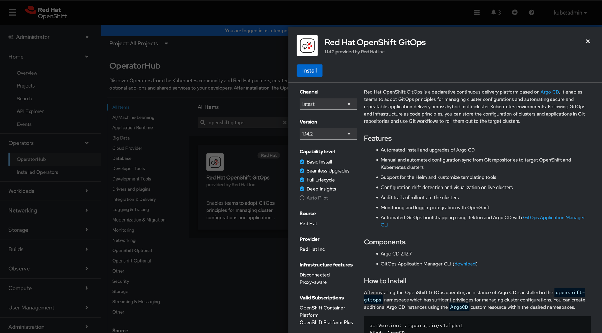
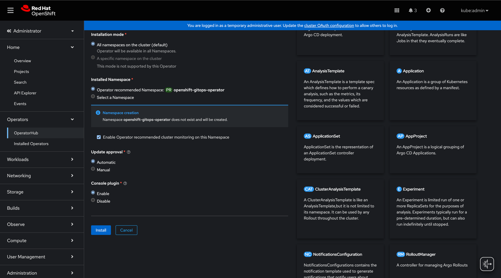
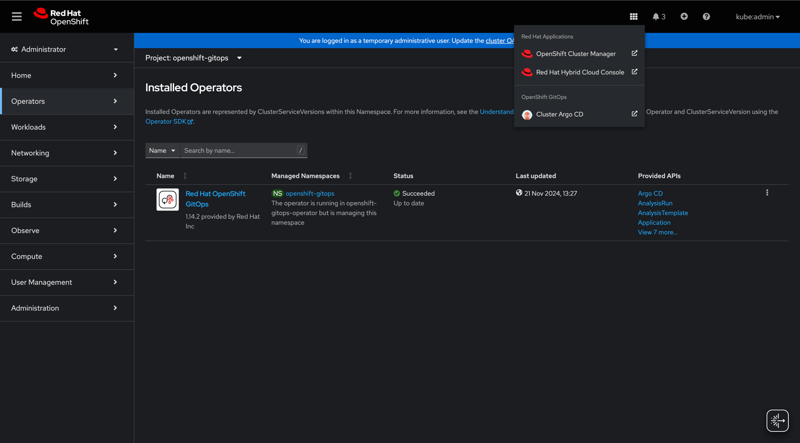
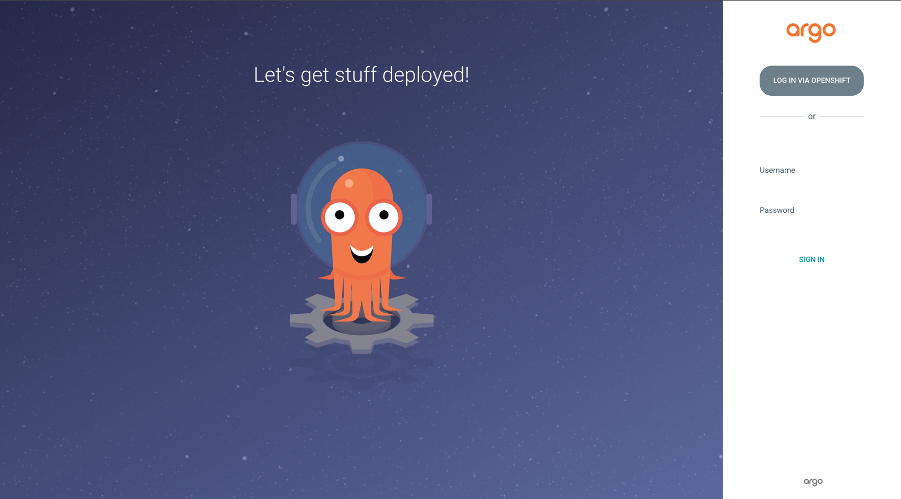
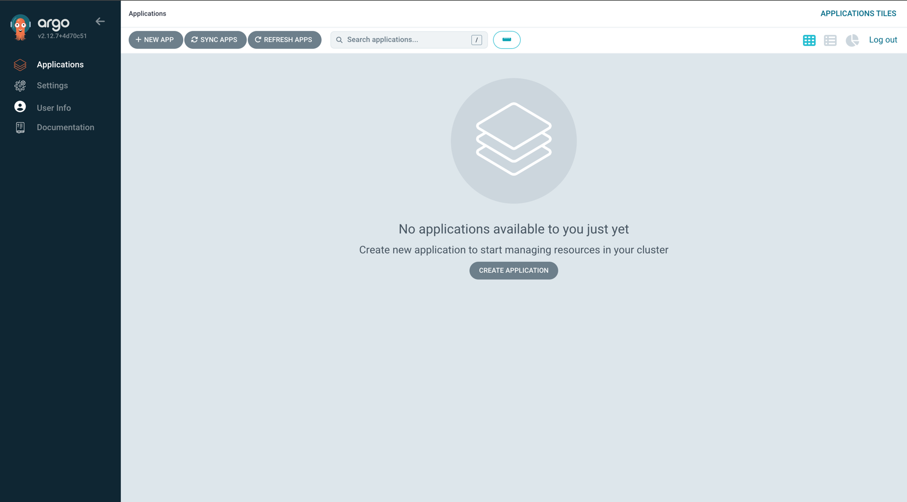
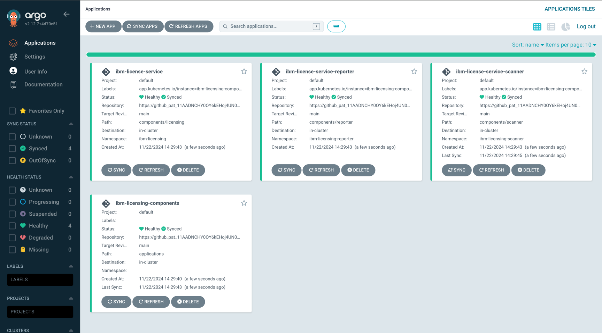
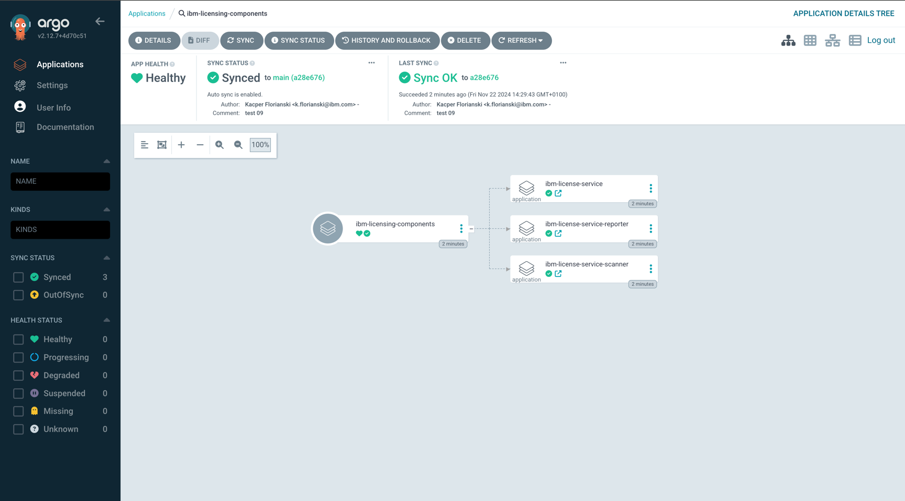
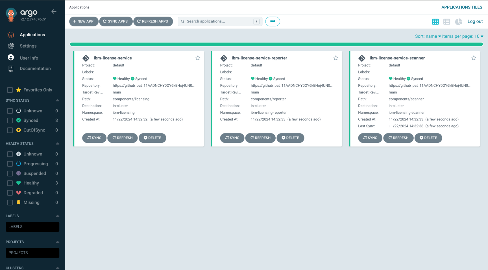

# IBM Licensing components as ArgoCD Applications

Provided functionalities:
- Installation of IBM License Service (ILS), ILS Reporter, and ILS Scanner
- Configuration of the components so that the whole licensing suite is functional

## Prerequisites

There is a number of steps involved before it's possible to deploy ArgoCD applications:
- There must be a cluster with ArgoCD installed
- ArgoCD application controller must have all required permissions OR
- The prerequisites to install the applications must be met

Below are instructions on how to provision and configure a cluster for IBM Licensing components.

### Install ArgoCD on an Openshift cluster

1. Install *Red Hat OpenShift GitOps* from the *OperatorHub* (see 
[RedHat documentation](https://docs.openshift.com/gitops/1.14/installing_gitops/installing-openshift-gitops.html)
for more information):




2. Access *ArgoCD* UI:




3. Log in via *OpenShift* and check the Applications screen is accessible:



### Apply prerequisites

There are multiple ways to apply prerequisites in your cluster. We recommend that the cluster admins review and apply
required modifications manually, however, this can also be automated.

#### Apply prerequisites' yaml files

You can apply (assuming you are logged in to the cluster) all prerequisites required for IBM Licensing components
with a simple command executed on the `prerequisites` directory:

```commandline
oc apply -f prerequisites
```

#### Include prerequisites as part of your ArgoCD deployment

To automate prerequisites deployment, you can include yaml files from the `prerequisites` directory in your ArgoCD
applications' paths. To make sure they are applied before the IBM Licensing components are installed, you can use
[sync waves](https://argo-cd.readthedocs.io/en/latest/user-guide/sync-waves/). For example, through annotating required
resources with the `PreSync` phase.

## Installation

Execute the following command (assuming you are logged in to your cluster):
```commandline
oc project openshift-gitops & helm template ./applications -f ./applications/values.yaml --set renderParentApplicationOnly=true | oc apply -f -
```

ArgoCD will deploy IBM Licensing components following the app-of-apps pattern:



If you want to deploy applications separately, please apply selected `yaml` files from the collection generated through
the following command:
```commandline
oc project openshift-gitops & helm template ./applications | oc apply -f -
```

The result is similar, but without the parent app:


The ArgoCD installation should be complete for a basic scenario. Please refer to the documentation of each component for
further configuration options. Please note that *IBM License Service Scanner* is not yet officially documented. Please
contact us to learn more about it.

## Common scenarios

Below are documented some sample, common issues, bundled with a description on how to solve them with ArgoCD.

### Change target namespace

By default, IBM Licensing components are installed in three different namespaces, to separate the resources and group
them up by the component. Since the YAML files provided as part of the `components` directory do not include the
namespace, to deploy the components to a different namespace, simply modify the ArgoCD `Application` YAML files
(the `destination.namespace` field).

Depending on your cluster configuration, you may also need to adjust referenced namespaces within the `prerequisites`
directory.

### Apply custom metadata

To apply custom labels or annotations, for example to the operators' deployments, the easiest is to directly modify
the `yaml` files in the `components` directory, before deploying the `Application`s.

## Maintenance

All `yaml` files in this repository must be kept up-to-date. Furthermore, to just update each component's versions,
please run `make update-version CURRENT_VERSION=x NEW_VERSION=y`, replacing both env vars with their respective values.
